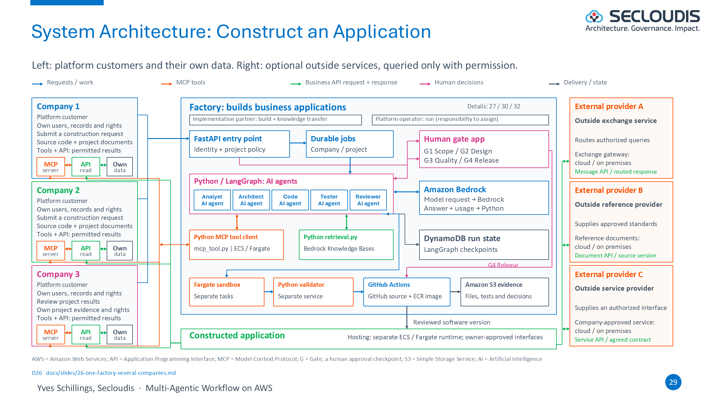
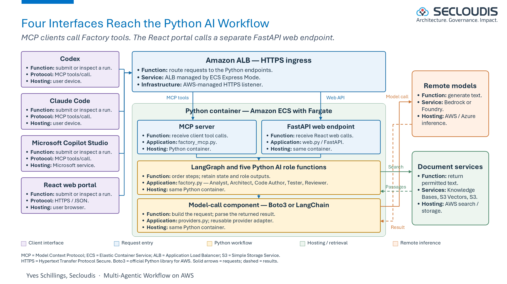

# AWS Agent Platform Lab

By **Yves Schillings, Secloudis** · [secloudis.com](https://secloudis.com/)

A hands-on AWS agent platform lab using synthetic data, Amazon Bedrock and controlled multi-agent workflows.

The project is an open-source foundation that organisations can inspect, run and adapt. Code licensing is Apache 2.0. The repository is public.

The delivery sequence is AWS first: deploy and verify this Bedrock implementation. An Azure variant is a separate later phase.

## Engineering documentation

The Secloudis article, Word review copy, presentation masters, PDFs and figure exports are maintained outside this source repository. This repository contains the application source, tests, infrastructure definitions, runbooks and technical implementation documentation.

The repository is public. Source availability does not establish that an AWS service has been deployed; deployment status is recorded only after live verification.

## Source publication evidence

- [Local verification and remaining cloud boundaries](docs/source-publication-verification.md).
- Code licence: [Apache 2.0](LICENSE). Diagram licence: [CC BY 4.0](docs/DIAGRAMS-LICENSE.md), with attribution to Yves Schillings, Secloudis.

## Reproducible RAG pipeline

- **RAG (Retrieval-Augmented Generation)**
  - Follow the [source-to-answer engineering guide](docs/rag-pipeline.md) for source fixtures, metadata, chunking, embeddings, filtered retrieval, model context and citations.
  - The implemented cloud adapter targets Bedrock Knowledge Bases with S3 Vectors; local mode uses lexical search.
  - The guide separates executable offline checks from the live ingestion and inference still to verify.

## Architecture

The platform accepts a governed application-construction request through either an MCP (Model Context Protocol) client or the browser. Python and LangGraph coordinate the five roles, verify the caller’s access, retrieve only permitted source passages, call the selected model, and pause at the required human gates.

<table>
  <tr>
    <td width="50%" valign="top">
      
      <p><strong>Construction workflow.</strong> The diagram shows the client entry points, the Python/LangGraph Factory, the approval gates, document retrieval, model inference and the separate candidate-validation boundary.</p>
    </td>
    <td width="50%" valign="top">
      
      <p><strong>Client access.</strong> Codex, Claude Code and Microsoft Copilot Studio call MCP tools. The React portal uses the FastAPI web endpoint. Both routes reach the same controlled Python workflow.</p>
    </td>
  </tr>
</table>

The diagrams are licensed under [CC BY 4.0](docs/DIAGRAMS-LICENSE.md), with attribution to Yves Schillings, Secloudis.

## MVP status

### Implemented in the public source repository

- **Business function: Factory workflow**
  - Five Python/LangGraph roles: Analyst, Architect, Code Author, Tester and Reviewer.
  - Four human gates: G1 Scope, G2 Design, G3 Quality and G4 Release.
  - A rejection stops the run; an approval is bound to the exact SHA-256 artifact hash.

- **Application layer: model and retrieval controls**
  - `FACTORY_PROVIDER=mock`, `aws`, `aws-langchain` and `azure` select the corresponding bounded provider adapter.
  - Python keeps a response only after role-schema validation and permitted-source citation validation.
  - The Factory never executes generated code or deploys a generated application.
  - Bedrock Knowledge Bases retrieval applies a server-owned company/project filter and rechecks each returned passage.

- **Application layer: identity and approval controls**
  - The local mode uses explicit simulated identities for development and tests.
  - The AWS code path verifies Cognito access tokens and derives the caller scope on the server.
  - The run owner cannot approve a production gate; a separate Cognito identity in the matching `factory-g1-approver` through `factory-g4-approver` group is required.
  - The browser Factory page supports the local harness and the enabled AWS/Cognito path.

- **Infrastructure layer: persistence and application runtime**
  - Local development uses SQLite checkpoints only.
  - The AWS deployment code configures shared DynamoDB checkpoints and a DynamoDB run registry, so either of two healthy Fargate tasks can resume the same waiting Factory run.
  - Terraform defines ECS/Fargate, Application Load Balancer, ECR, Cognito, S3, KMS, IAM, CloudWatch, Bedrock Knowledge Bases and S3 Vectors.
  - GitHub Actions and scripts build, publish, deploy, validate and roll back the container delivery path.

### AWS deployment code is prepared; live execution is not yet claimed

- **Terraform execution**
  - The reviewed account-specific variables must be supplied.
  - Terraform must create the resources in the authorised AWS account.

- **Container delivery**
  - The exact image digest must be published to Amazon ECR and selected by the ECS service.
  - The running tasks must pass their health checks behind the Application Load Balancer.

- **Identity, retrieval and inference**
  - A real Cognito user must sign in through the configured callback URL.
  - The synthetic corpus must be ingested into the Knowledge Base.
  - A real Bedrock response must be retrieved and recorded with its permitted citations and usage evidence.

- **Publication evidence**
  - The Secloudis article will include the live Cognito, Bedrock, Knowledge Base, ECS/Fargate and GitHub Actions evidence after those checks succeed.
  - Source availability alone does not prove a live AWS deployment.
**Preserved baseline:** the following application remains available independently at `/` and through its original command-line interface.

The lab now includes a FastAPI/browser application and a command-line workflow. An analyst, designer and reviewer run in sequence, with at most two correction rounds before an explicit human decision. Approval is bound to the SHA-256 hash of the exact artifact.

The local browser mode uses deterministic mock responses, a synthetic corpus, two simulated identities and a bounded stdio Model Context Protocol (MCP) checklist tool. Run/source access checks, exact-artifact decisions, persistence, safe traces and failure paths are exercised locally. The interface visibly labels simulated inference and identities.

The AWS code path includes Cognito access-token verification, server-filtered Bedrock Knowledge Bases retrieval, Bedrock Converse and S3 artifact storage with conditional writes. Terraform, a container definition and GitHub workflow files describe the deployment path. **A successful real Cognito login, Bedrock/Knowledge Bases call or AWS deployment remains to be verified in an authorised account.** Local tests and fake SDK transports do not establish those outcomes.

A legacy Azure adapter remains for provider-contract tests; the web service and deployment target AWS. See [the architecture](docs/architecture.md), [authentication boundary](docs/authentication.md) and [implementation backlog](docs/implementation-backlog.md).

## Run locally with Python 3.12

Windows PowerShell, from this directory:

```powershell
py -3.12 -m venv .venv
.\.venv\Scripts\python.exe -m pip install -r requirements.txt
.\.venv\Scripts\python.exe -m pip install --no-deps -e .
.\.venv\Scripts\python.exe -m unittest discover -s tests -v
$env:LOCAL_DEMO_MODE = 'true'
.\.venv\Scripts\python.exe -m aws_agent_platform_lab.web
```

Open [the local browser interface](http://127.0.0.1:8000). It binds only to loopback in local mode. [The local demonstration guide](docs/local-demo.md) explains the two synthetic workspaces, source viewer, evidence and decisions. Generated state uses the ignored `.lab-data` directory. On macOS/Linux use `python3.12`, `.venv/bin/python` and `export LOCAL_DEMO_MODE=true` for the equivalent commands.

The [Factory browser page](http://127.0.0.1:8000/factory) supports three separate simulated local identities and the same ignored data root. Set `FACTORY_PROVIDER=mock` to exercise the model-backed path offline. In AWS mode it is exposed only when `FACTORY_ENABLED=true`, authenticates with Cognito, and uses the server-owned identity scope. Multi-company federation, cross-company grants and remote MCP/OAuth clients are outside this MVP.

`requirements.txt` pins the dependency versions used for verification. The core CLI mock path itself uses only the standard library; the full browser and authentication tests require the installed dependencies.

## Command-line workflow

The CLI remains useful for inspecting the original local workflow directly:

```powershell
.\.venv\Scripts\python.exe -m aws_agent_platform_lab.cli run --provider mock --scenario scenarios/demo.json --corpus corpus/knowledge.json --output demo_runs/local_001
```

Each output directory must be new or empty. The run ends at `waiting_approval`. Inspect `demo_runs/local_001/artifact.json` before recording a decision:

```powershell
$runState = Get-Content -Raw 'demo_runs/local_001/state.json' | ConvertFrom-Json
.\.venv\Scripts\python.exe -m aws_agent_platform_lab.cli approve --run-dir demo_runs/local_001 --artifact-hash $runState.artifact_hash --decision approve
```

Use `--decision reject` to reject the proposal. A rejection never publishes. A wrong hash or a modified artifact blocks the action. This local command records an operator decision; it does not authenticate a human identity.

## Use Amazon Bedrock

Follow [the AWS setup notes](aws/README.md). Install the optional SDK only in the local environment:

```powershell
.\.venv\Scripts\python.exe -m pip install -e '.[aws]'
```

Configure an authorised AWS role or profile, region and available Converse-compatible model. For the CLI, `--provider aws` invokes Bedrock directly through Boto3. The Factory can alternatively select `FACTORY_PROVIDER=aws-langchain` to invoke the same Bedrock model through LangChain. For the web service, absent/false `LOCAL_DEMO_MODE` selects the AWS path and requires the configured identity, retrieval, model and storage services. Those operations can incur charges. Keep credentials outside the repository and keep the supplied examples synthetic.

## What the workflow proves

1. **Retrieval:** local browser retrieval applies identity scope before lexical ranking. AWS retrieval sends a server-owned tenant/access filter to Knowledge Bases and checks returned source metadata again. That SDK boundary is tested with fake responses; a live vector index remains unverified. The original CLI corpus flags are declarations, not identity controls or anonymisation.
2. **Analysis and design:** agents produce structured JSON. Required fields and cited source identifiers are validated.
3. **Review and correction:** the reviewer can request changes. Two corrections after the first draft give at most seven agent calls. Distinct roles do not guarantee independent judgement or truth.
4. **Human decision:** a favourable reviewer result pauses the run. It never authorises publication by itself.
5. **Publication:** the operator can approve the exact hash. The browser service stores the decision and publication state atomically with the artifact; the CLI copies to its fixed `published/approved_workflow.json` path. Model text is never executed as code, a shell command or a chosen output path.

Citation checks establish that identifiers refer to retrieved documents; they do not prove that every claim is supported semantically. Local files are not a tamper-proof audit store. The browser service bounds concurrent work and uses versioned state, but does not claim automatic recovery of interrupted execution or production multi-tenant operation.

## Files to inspect after a CLI run

| File | Purpose |
|---|---|
| `input_snapshot.json` | Synthetic request and retrieved documents |
| `analyst.00.json`, `designer.00.json`, `reviewer.00.json` | Validated agent outputs; corrections use later revision numbers |
| `artifact.json` | Final proposal and its evidence |
| `state.0001.json` and later snapshots | Numbered local state history |
| `state.json` | Most recent state |
| `trace.jsonl` | Roles, events, revisions, latency, hashes and available usage data |
| `human_decision.json` | Explicit local decision and the exact artifact hash |
| `published/approved_workflow.json` | Approved local result |

Unknown cloud cost is `null`, not zero. The mock provider reports simulated zero usage. Generated runs, secrets, environments and Terraform state are ignored by Git.

## Next steps

The [proposed AWS architecture](docs/architecture.md) uses ECS Express Mode on Fargate for a FastAPI/browser container, Cognito verified by the API, Bedrock Converse, Bedrock Knowledge Bases backed by S3 Vectors, a local stdio MCP tool, ordinary S3 artifacts and CloudWatch logs with OpenTelemetry instrumentation. Cloud resources remain to be deployed and validated.

The [epic and feature backlog](docs/backlog/epics-features.md) organises the proposed delivery sequence into nine epics and 35 features; detailed items are not yet expanded. The existing [LAB technical issue specifications](docs/implementation-backlog.md) retain implementation acceptance detail and recorded evidence for Terraform, GitHub Actions with OpenID Connect, runbooks and workflow evaluation. These are complementary planning levels, not duplicate published GitHub issues; existing LAB identifiers remain unchanged.

The [staged delivery plan](docs/four-day-plan.md) progresses from account readiness to the first verified AWS demonstration through Stage 1–4. It distinguishes implemented evidence from planned platform capabilities. No remote repository or cloud resources are created by this source tree.

Follow the [deployment guide](docs/deployment.md), [operating runbook](docs/operations.md)
and [rollback procedure](docs/rollback.md) for the AWS stage.
