# Multi-Agentic Workflow on AWS

By **Yves Schillings, Secloudis**

- **Purpose**
  - Turn an application request into reviewed requirements, architecture, candidate code and proposed tests.
  - Five AI agents prepare proposals; authorised humans decide at four gates.
  - This synthetic proof of concept does not autonomously execute or deploy generated applications.
- **Current hosting**
  - The HTML (Hypertext Markup Language) portal runs on ECS (Elastic Container Service) and Fargate.
  - LangGraph and all five Python agents run in Amazon Bedrock AgentCore Runtime.
  - Amazon Bedrock supplies model inference, not hosting for the Python agents.
- **Start here**
  - [Complete Secloudis article](https://secloudis.com/multi-agentic-workflow-on-aws/).
  - [Current implementation: Agent-Core branch](https://github.com/yves-schillings/aws-agent-platform-lab/tree/Agent-Core).
  - This README also appears on main; runtime implementation links explicitly select Agent-Core.

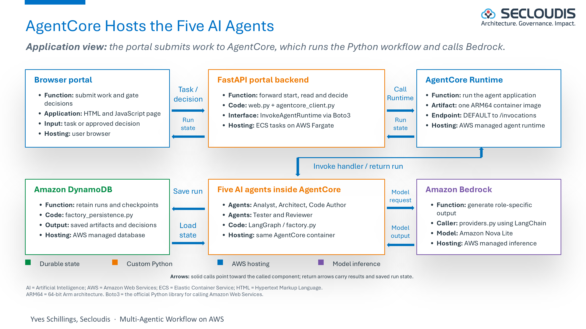

## Contents

1. [The Problem and the Workflow](#1-the-problem-and-the-workflow)
2. [Architecture and Hosting](#2-architecture-and-hosting)
3. [Security and Client Access](#3-security-and-client-access)
4. [Model Selection](#4-model-selection)
5. [Code Structure and Deployment](#5-code-structure-and-deployment)
6. [Evidence and Results](#6-evidence-and-results)
7. [Limits and Roadmap](#7-limits-and-roadmap)
8. [Reuse and Lessons](#8-reuse-and-lessons)

## 1. The Problem and the Workflow

- **Business request**
  - A requester describes an application and acceptance criteria.
  - The workflow retrieves permitted references and retains artifacts for review.
- **Analyst AI agent**
  - **Input:** business request and permitted reference passages.
  - **Action:** clarify scope, requirements, constraints and acceptance criteria.
  - **Output:** requirements proposal for G1.
- **Architect AI agent**
  - **Input:** approved scope and reference material.
  - **Action:** propose components, interfaces, security and hosting boundaries.
  - **Output:** architecture proposal for G2.
- **Code Author AI agent**
  - **Input:** approved requirements and architecture.
  - **Action:** generate candidate source files and supporting configuration.
  - **Output:** candidate code, not a deployed application.
- **Tester AI agent**
  - **Input:** candidate code and acceptance criteria.
  - **Action:** propose tests and expected outcomes.
  - **Output:** test proposal, not proof of executed tests.
- **Reviewer AI agent**
  - **Input:** candidate artifacts and proposed tests.
  - **Action:** assess consistency, defects and unresolved risks.
  - **Output:** findings and a recommendation, not a human approval.
- **Four human gates**
  - **G1 Scope:** approve or reject requirements.
  - **G2 Design:** approve or reject architecture.
  - **G3 Quality:** assess candidate artifacts and review findings.
  - **G4 Release:** record a release decision; this does not execute or deploy code.
  - Decisions apply to the exact artifact hash and require an authorised identity distinct from the requester.

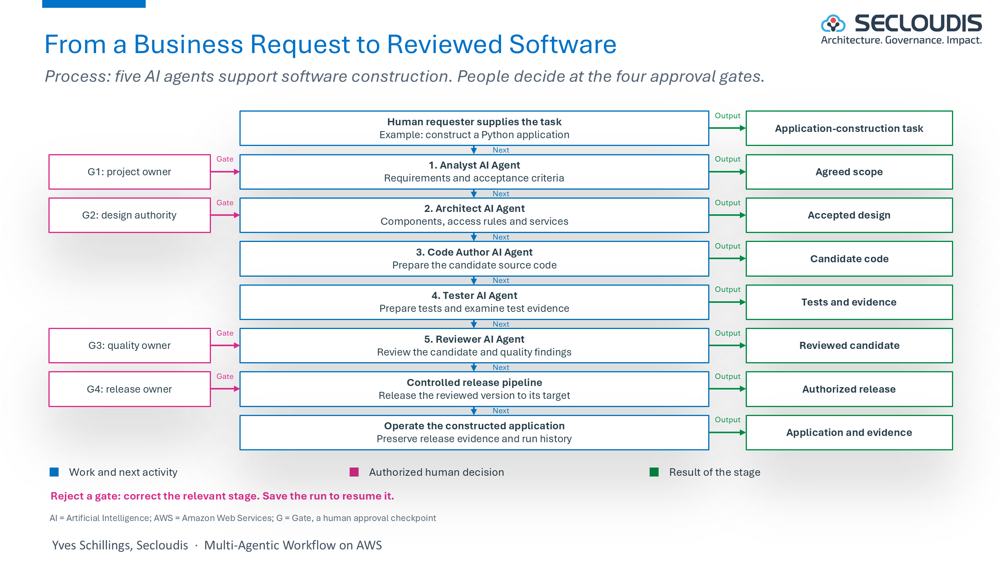

- **LangGraph transitions**
  - Role execution pauses at human gates.
  - A failed role or rejected gate stops the workflow.
  - The compiled graph shows possible transitions, not a specific execution trace.
  - [Workflow source](https://github.com/yves-schillings/aws-agent-platform-lab/blob/Agent-Core/src/aws_agent_platform_lab/factory.py).

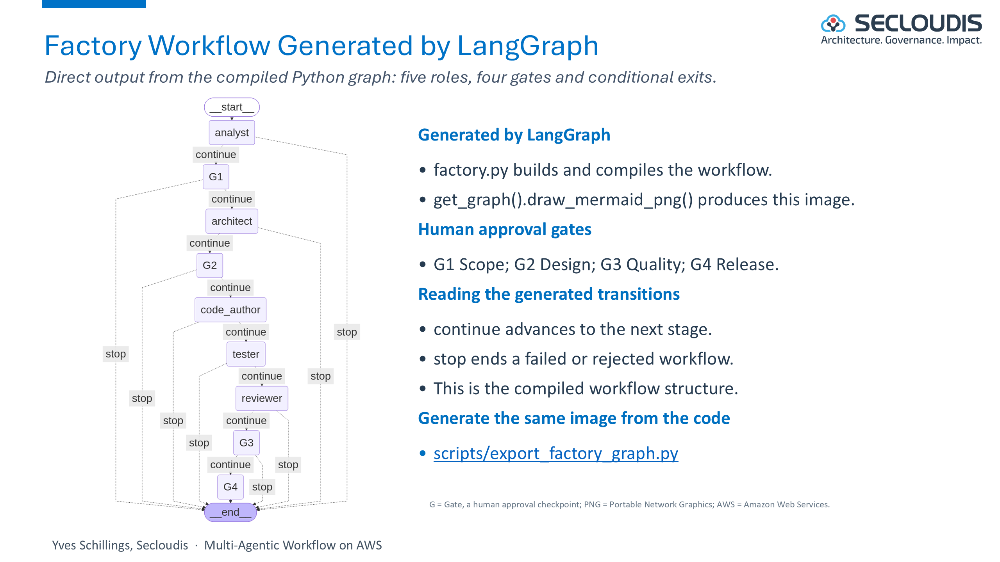

## 2. Architecture and Hosting

- **Portal**
  - HTML, CSS (Cascading Style Sheets) and JavaScript implement the browser interface.
  - FastAPI serves the page and web endpoints in ECS-managed Fargate tasks.
  - An ALB (Application Load Balancer) routes browser traffic.
- **Agent application**
  - AgentCore Runtime hosts the custom Python container and its five agents.
  - LangGraph coordinates nodes, transitions, state and approval pauses.
  - DynamoDB retains workflow state and checkpoints.
- **Model and retrieval**
  - The Python provider prepares requests and calls Bedrock through LangChain or Boto3, the official Python library for calling Amazon Web Services.
  - Bedrock returns model output and usage.
  - Bedrock Knowledge Bases retrieves permitted indexed source passages.

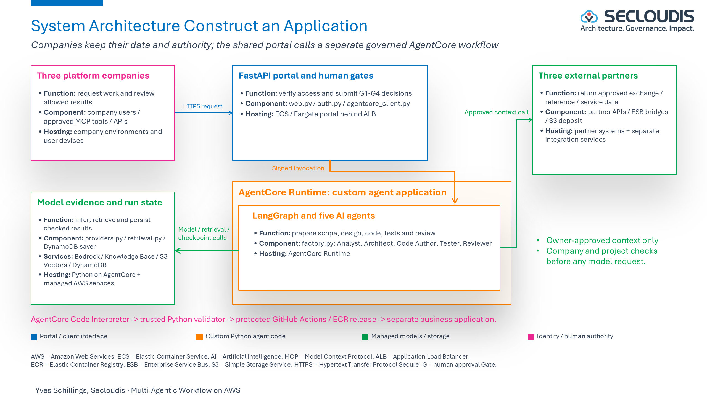

- **LangGraph plus AgentCore**
  - LangGraph is an orchestration library inside the application.
  - AgentCore Runtime is the managed hosting service for that application.
  - They complement each other; Bedrock inference remains a separate call.

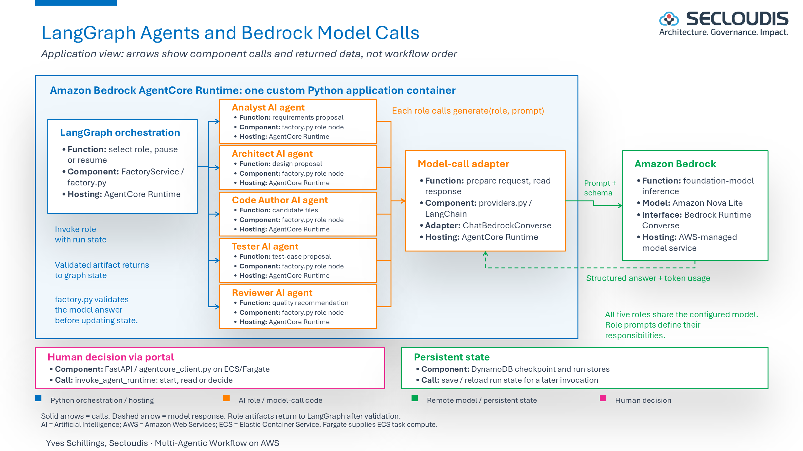

- **Source to browser**
  - GitHub stores source and build definitions.
  - ECR (Elastic Container Registry) stores container images; it does not serve web pages.
  - ECS maintains portal tasks and Fargate provides compute.
  - The agent container runs separately in AgentCore.

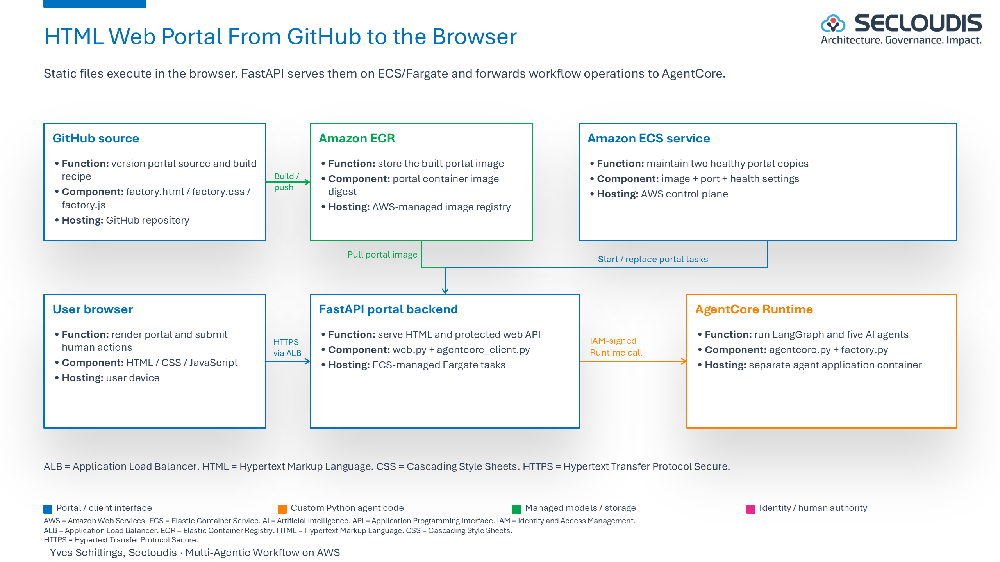

## 3. Security and Client Access

- **Four interface choices**
  - The deployed portal uses HTML, not React.
  - Codex, Claude Code and Microsoft Copilot Studio remain candidate MCP (Model Context Protocol) clients.
  - React remains an alternative portal interface.
  - The current MCP harness uses local standard input/output; remote integrations require separate implementation and tests.
- **Verified web boundary**
  - Cognito authenticates the human.
  - The portal invokes AgentCore using its IAM (Identity and Access Management) role.
  - The runtime application verifies the Cognito token again.
  - Server-owned company and project permissions control sources and actions.
- **Trust boundary**
  - Model text cannot grant access or approve a gate.
  - Requester self-approval is refused.
  - Tokens and credentials must not enter prompts, public evidence or logs.
  - [Runtime access controls](https://github.com/yves-schillings/aws-agent-platform-lab/blob/Agent-Core/docs/agentcore-runtime.md).

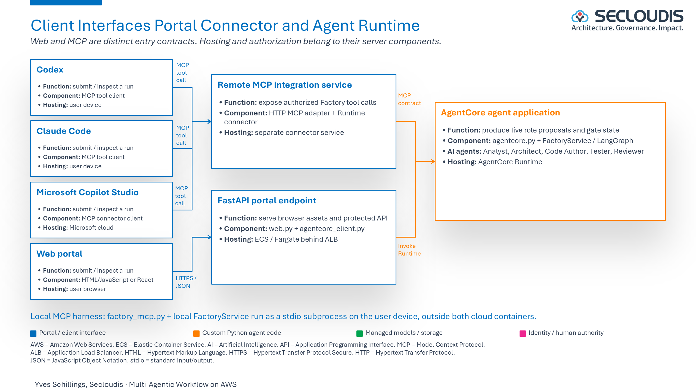

## 4. Model Selection

- **Provider options**
  - mock supports deterministic offline checks.
  - aws invokes Bedrock through Boto3.
  - aws-langchain invokes Bedrock through LangChain.
  - The recorded AgentCore workflow uses Amazon Nova Lite v1.
- **Evaluation**
  - Deployment evidence records token usage by role.
  - Workflow completion does not certify generated-code quality.
  - Fair model comparisons require identical inputs and acceptance criteria.
  - The legacy Azure adapter is not a verified cross-cloud deployment.
  - [Model-backed workflow notes](https://github.com/yves-schillings/aws-agent-platform-lab/blob/Agent-Core/docs/factory-model-backed.md).

## 5. Code Structure and Deployment

- **Portal source**
  - [factory.html](src/aws_agent_platform_lab/static/factory.html), [factory.css](src/aws_agent_platform_lab/static/factory.css) and [factory.js](src/aws_agent_platform_lab/static/factory.js) implement presentation and browser actions.
  - [web.py](https://github.com/yves-schillings/aws-agent-platform-lab/blob/Agent-Core/src/aws_agent_platform_lab/web.py) serves the portal and checks requests.
- **Runtime source**
  - [agentcore_client.py](https://github.com/yves-schillings/aws-agent-platform-lab/blob/Agent-Core/src/aws_agent_platform_lab/agentcore_client.py) invokes AgentCore from the portal.
  - [agentcore.py](https://github.com/yves-schillings/aws-agent-platform-lab/blob/Agent-Core/src/aws_agent_platform_lab/agentcore.py) implements the runtime request boundary.
  - [factory.py](https://github.com/yves-schillings/aws-agent-platform-lab/blob/Agent-Core/src/aws_agent_platform_lab/factory.py) defines the governed workflow.
- **Separate images**
  - [Dockerfile](Dockerfile) packages the portal.
  - [Dockerfile.agentcore](https://github.com/yves-schillings/aws-agent-platform-lab/blob/Agent-Core/Dockerfile.agentcore) packages the ARM64 runtime.
- **Controlled deployment**
  - Infrastructure creation is separate from image promotion.
  - Read the [AgentCore guide](https://github.com/yves-schillings/aws-agent-platform-lab/blob/Agent-Core/docs/agentcore-runtime.md), [deployment runbook](docs/deployment.md) and [rollback procedure](docs/rollback.md).
  - [deploy_express.py](scripts/deploy_express.py) promotes an immutable image to an existing ECS service.
  - Cloud operations can incur charges; keep private configuration and credentials outside Git.

## 6. Evidence and Results

### Local Docker Checks

- **Actual Docker screenshot**
  - The slide below contains the Docker Desktop capture of the local verification container.
  - It records historical packaging checks, not the live AgentCore runtime.
  - Resource readings concern the development computer.
- **Check scope**
  - [container_smoke.py](scripts/container_smoke.py) checks health, packaged browser assets and offline workflow behavior.
  - Simulated identities and offline responses do not establish cloud authentication or inference.

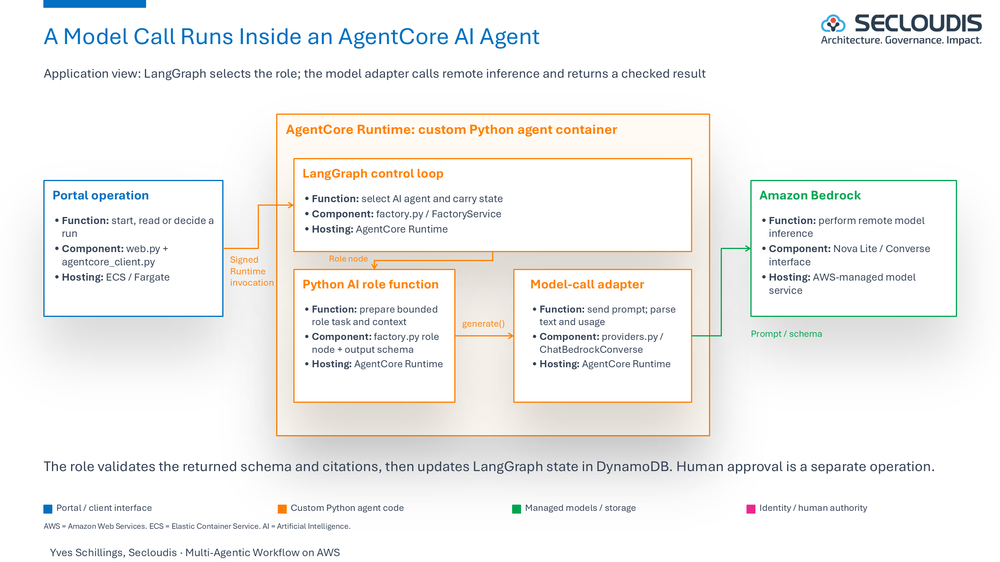

### Browser and Authentication

- **Portal**
  - The screenshot shows the Factory interface.
  - A visible page alone does not establish workflow completion.

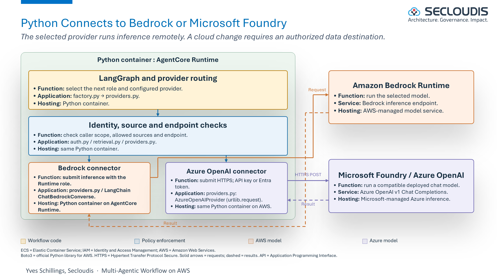

- **Cognito**
  - The sign-in screenshot establishes the authentication entry point.
  - The next capture shows an authenticated synthetic request before launch, with the identifier hidden.

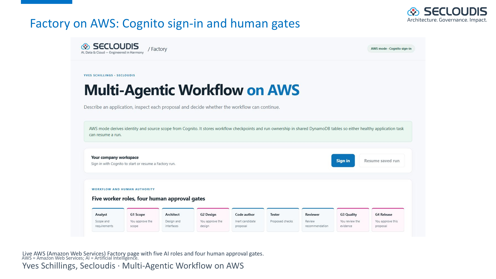

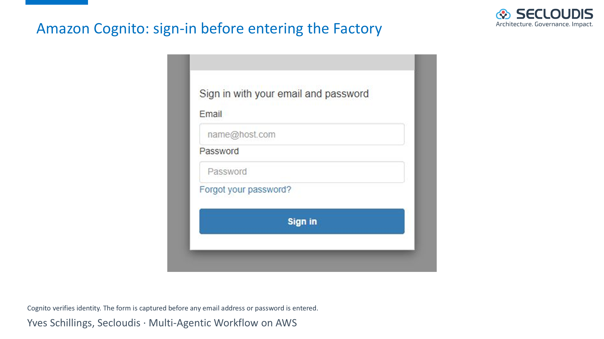

- **Historical failure**
  - An early launch stopped when its mandatory filter found no permitted references.
  - Scoped documents and metadata sidecars were subsequently indexed.
  - This screenshot is retained as historical evidence, not current deployment status.

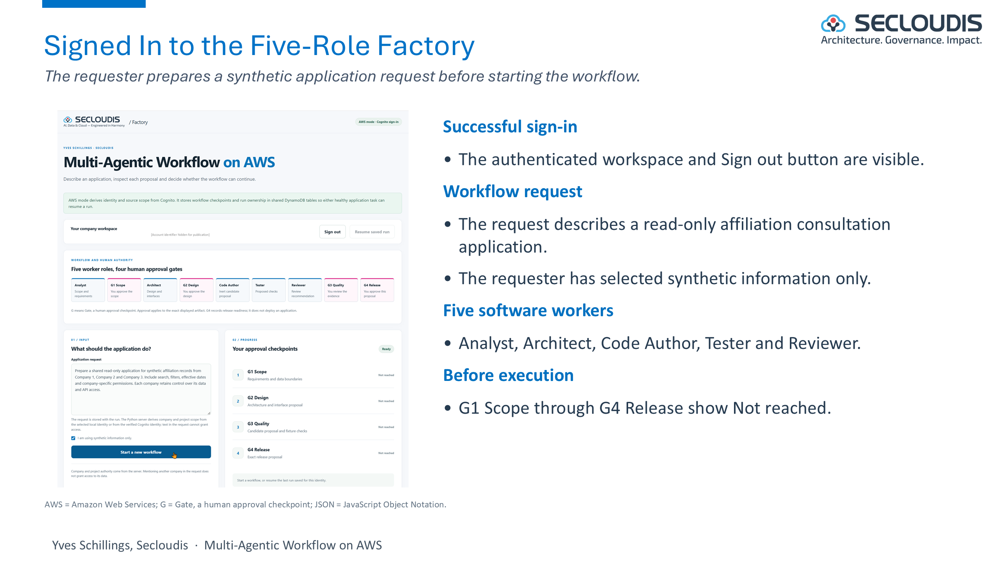

### Deployment and Costs

- **3 October 2026**
  - Before AgentCore, the complete Factory ran as two ECS-managed Fargate tasks.
  - That historical deployment differs from the current portal-only ECS role.
- **5 October 2026**
  - [Deployment evidence](https://github.com/yves-schillings/aws-agent-platform-lab/blob/Agent-Core/docs/agentcore-deployment-evidence.json) records AgentCore Runtime version 4 and five Bedrock-backed roles.
  - Four scripted decisions used distinct verified Cognito identities; no substantive human review is claimed for that scripted run.
  - [Portal verification](https://github.com/yves-schillings/aws-agent-platform-lab/blob/Agent-Core/docs/factory-ui-deployment.md) records the separate browser journey.
- **Provisional financial evidence**
  - The article's section 6.5 reports USD 6.8379 before credits, approximately USD 0.00 net, at account level for 3 to 5 October.
  - This is not a final invoice, an isolated platform bill or a measured per-run cost.
  - The period does not include 6 October.

## 7. Limits and Roadmap

- **Execution and release**
  - Generated code and proposed tests are not independently executed in the recorded workflow.
  - Code Interpreter, independent validation and generated-application deployment require separate acceptance evidence.
- **Enterprise access**
  - Multi-company federation, collaboration grants and remote MCP integration are separate extensions.
  - Five role names do not guarantee independent judgement or factual correctness.
- **Recovery and evidence**
  - Forced runtime replacement and long-pause recovery require live tests.
  - Checkpoints alone do not establish production availability.
  - Citation identifiers do not prove every claim; local logs are not a tamper-proof audit store.
  - [Implementation backlog](docs/implementation-backlog.md) and [epics and features](docs/backlog/epics-features.md) describe outstanding work.

## 8. Reuse and Lessons

- **Local setup**
  - Use Python 3.12 and pinned dependencies.
  - These commands run tests and an offline demonstration, not an AWS deployment.

```powershell
py -3.12 -m venv .venv
.\.venv\Scripts\python.exe -m pip install -r requirements.txt
.\.venv\Scripts\python.exe -m pip install --no-deps -e .
.\.venv\Scripts\python.exe -m unittest discover -s tests -v
$env:LOCAL_DEMO_MODE = 'true'
$env:FACTORY_PROVIDER = 'mock'
.\.venv\Scripts\python.exe -m aws_agent_platform_lab.web
```

- **Local entry points**
  - Open [the Factory](http://127.0.0.1:8000/factory).
  - The original three-role workflow remains at /demo; it is not the five-role Factory.
  - [Local guide](docs/local-demo.md) explains synthetic identities and ignored state.
- **Lessons**
  - Separate source publication, packaging, cloud deployment and acceptance evidence.
  - Measure usage, latency and failures instead of inferring benefits from screenshots.
  - Approval authorises the exact artifact, not arbitrary later content.
  - [Operations](docs/operations.md) and [persistence verification](docs/persistence-verification.md) provide supporting records.
- **Licensing and figure provenance**
  - Code: [Apache 2.0](LICENSE).
  - Diagrams: [CC BY 4.0](docs/DIAGRAMS-LICENSE.md), attributed to Yves Schillings, Secloudis.
  - All twelve README images are native exports from the approved Secloudis PowerPoint v2.85.
  - [Export manifest](docs/images/secloudis-slide-exports.json) records figures, slides and SHA-256 checksums.
