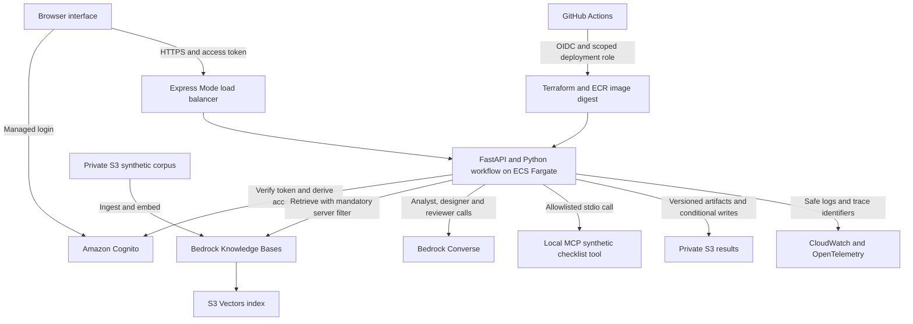

# Proposed AWS demonstration architecture

This is the AWS deployment target. The source now includes the browser/API, identity verification, scoped retrieval, storage, MCP tool, telemetry and infrastructure definitions alongside the original CLI workflow. Local tests and a browser demonstration exercise the synthetic path. The cloud components still require real account execution evidence.

## Implementation boundaries

- **Runtime:** one small browser/FastAPI container on ECS Express Mode using Fargate. Keep the existing Python orchestration and bounded correction loop. Kubernetes is outside the initial demonstration.
- **User identity:** Cognito managed login and two synthetic users, with public sign-up disabled. FastAPI verifies tokens and owns route, run, source and tool authorisation. The diagram does not assume load-balancer authentication is already configured.
- **Retrieval:** private ordinary S3 source objects feed Bedrock Knowledge Bases backed by S3 Vectors. Metadata includes stable document ID/version and scope. Trusted API code supplies a mandatory equality/conjunction filter from verified identity. Missing scope fails closed.
- **Models:** the existing Converse adapter uses the task role and an explicitly permitted model/profile. Confirm model access, processing regions and invocation permissions in the account.
- **Tool:** one pinned official MCP Python SDK stdio server runs the deterministic read-only `check_required_documents` tool. The host fixes the executable, validates arguments and enforces scope. No model-supplied command or URL is executed.
- **Evidence:** versioned ordinary S3 objects, separate from the vector index, retain exact artifacts and decisions. Use conditional writes; do not treat S3 as a multi-record transaction database. Limit the first service to one active run per user and fail interrupted runs explicitly.
- **Operations:** CloudWatch structured logs and OpenTelemetry spans identify run, agent, retrieval, model and tool stages. Prompt/document bodies are excluded by default. External telemetry exporters remain optional integrations to configure and test.
- **Delivery:** GitHub Actions checks and builds the image; OIDC grants a scoped AWS deployment role. Terraform manages the service and supporting resources. Deploy by digest and rehearse recovery to the last verified digest/configuration.

## Details to verify before a live deployment

Regional service and model availability; exact provider/SDK versions; Cognito issuer, client and scopes; server-owned document policy; task/execution/ingestion/deployment IAM roles; Express public/private networking defaults; source and artifact retention; explicit scaling caps and alarms; OIDC subject format for the actual repository; costs and cleanup.

Cloud execution evidence must remain distinct from local/mock tests. Secrets, personal data and business documents remain outside this repository.

## Official implementation references

- [ECS Express Mode](https://docs.aws.amazon.com/AmazonECS/latest/developerguide/express-service-overview.html)
- [Cognito token verification](https://docs.aws.amazon.com/cognito/latest/developerguide/amazon-cognito-user-pools-using-tokens-verifying-a-jwt.html)
- [Bedrock vector-store prerequisites](https://docs.aws.amazon.com/bedrock/latest/userguide/knowledge-base-setup.html)
- [S3 Vectors](https://docs.aws.amazon.com/AmazonS3/latest/userguide/s3-vectors.html)
- [Bedrock Converse](https://docs.aws.amazon.com/bedrock/latest/APIReference/API_runtime_Converse.html)
- [Official MCP Python SDK](https://github.com/modelcontextprotocol/python-sdk)
- [S3 conditional writes](https://docs.aws.amazon.com/AmazonS3/latest/userguide/conditional-writes.html)
- [GitHub OIDC for AWS](https://docs.github.com/en/actions/how-tos/secure-your-work/security-harden-deployments/oidc-in-aws)
- [Terraform ECS Express resource](https://registry.terraform.io/providers/hashicorp/aws/latest/docs/resources/ecs_express_gateway_service)
