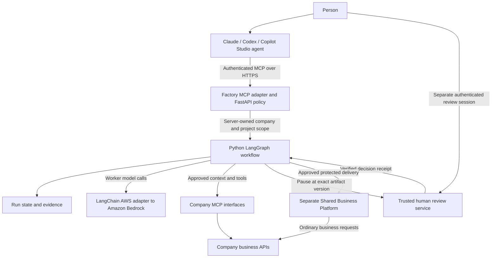
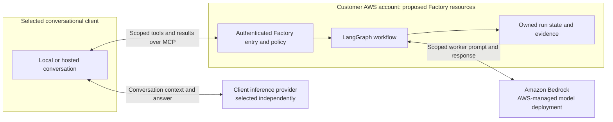

# Conversational access to the Factory

Claude, Codex and an agent built in Microsoft Copilot Studio are possible interfaces to the same AWS-hosted Factory. They do not require moving the Factory to the client's cloud. This is an integration design, not a verified connection: each client still needs a compatible transport, authentication, network access, tool permissions and a tested human-review experience. The interface choice remains open; `/factory` is a local prototype and test harness.

Product documentation was checked on 1 October 2026. Availability, subscriptions, tenant policies and the installed client version must be checked for the actual account before selecting a route.

## What exists in this repository

| Component | Current evidence and limit |
|---|---|
| [Factory backend](../src/aws_agent_platform_lab/factory.py) | Local LangGraph workflow with five deterministic workers and four simulated human gates; SQLite persistence. No model inference, generated-code execution or application deployment |
| [Browser and HTTP routes](../src/aws_agent_platform_lab/web.py) | Local `/factory` and `/api/factory/runs`; simulated identities. Cloud access to the Factory routes is disabled. `X-Demo-User` is not remote authentication |
| [Factory MCP adapter](../src/aws_agent_platform_lab/factory_mcp.py) | Local **stdio** implementation with protocol tests. Host fixes the simulated identity and storage. Tools describe, start and inspect runs. Client form review is disabled by default and requires explicit simulation opt-in. No remote HTTPS listener or OAuth implementation |
| [Existing checklist MCP server](../src/aws_agent_platform_lab/mcp_server.py) | Separate local tool for the earlier demonstration; not the Factory entry point |
| AWS and conversational clients | No verified Claude, Codex or Copilot Studio connection to this Factory; no verified remote approval service. The latest deployment preflight found no AWS credentials and no running local Docker engine; see the [development evidence](development-start.md) |

The local adapter rejects model-supplied identity, company scope, decision and approval-hash arguments. Its review operation nevertheless trusts the MCP client to show the complete proposal to a person and return that person's answer. This is a **local simulation trust boundary**, not proof of an authenticated human decision. A successful local protocol test must not be reported as a successful connection to a product or to AWS.

## Client options

| Interface | Concrete connection route | What to qualify |
|---|---|---|
| **Claude conversational client** | A Claude Desktop local MCP server can run on the workstation. A remote custom connector uses a server URL and its authentication flow | Remote connector requests originate in Anthropic's cloud, including when using Claude Desktop. A user-accessible private VPN address is insufficient: the endpoint must be reachable from Anthropic. Local Desktop configuration is a separate mechanism. Organisation controls and the selected surface matter. [Claude connector documentation](https://support.claude.com/en/articles/11175166-get-started-with-custom-connectors-using-remote-mcp) |
| **Codex local client** | Configure a local stdio command or a Streamable HTTP URL; use the server's OAuth flow for the remote route. Codex CLI, IDE extension and the documented desktop host share MCP configuration | Register the correct callback and permitted tools; test the installed host's interaction capabilities. Local configuration does not prove cloud-client availability. A ChatGPT/Codex login is not automatic authentication to our AWS service. [Codex MCP documentation](https://learn.chatgpt.com/docs/extend/mcp?surface=cli) |
| **Microsoft Copilot Studio agent** | In the standard agent configuration: Tools → Add a tool → New tool → Model Context Protocol; configure the remote URL, connection and OAuth. Copilot Studio supports Streamable transport | Connector policies, identity mapping, tenant permissions and connectivity must pass. Microsoft documents a remote server URL contract, so an AWS endpoint is a viable design inference; it has not been tested here. This route needs a remote adapter, not our local stdio process. [Copilot Studio MCP setup](https://learn.microsoft.com/en-us/microsoft-copilot-studio/mcp-add-existing-server-to-agent) |

For Microsoft, the proposed interface is **our agent built in Copilot Studio and published to Teams and/or Microsoft 365 Copilot**. This does not mean that an arbitrary consumer Copilot chat can attach to our backend. Publishing and channel configuration are separate steps, subject to the organisation's policies. Test a restricted published instance before broader availability. [Microsoft publication guidance](https://learn.microsoft.com/en-us/microsoft-copilot-studio/publication-fundamentals-publish-channels)

Claude Code is another technical MCP client and can also serve as an independent code reviewer. These are different assignments: connecting it to Factory tools does not automatically conduct an independent review or give it approval authority. Its documentation describes interactive form/URL elicitation **and hooks that can answer elicitation automatically**. This is one concrete reason not to treat a protocol form response as independent proof of a person. [Claude Code MCP and elicitation](https://code.claude.com/docs/en/mcp)

## Keep the client, workflow and model separate

The following is the proposed remote architecture. Only the local workflow and stdio adapter described above currently exist.

The conversational client's model interprets the user's request and selects permitted tools. LangGraph owns the Factory's durable steps, role transitions and gate pauses. A worker may later call a Claude model through **Amazon Bedrock** using the server's AWS role; that is independent of whether the person talks through Claude, Codex or Microsoft. The local workers currently return deterministic proposals, so this diagram is not evidence of real Bedrock inference.

Keep four identities separate: the person signed in to the client; the principal authorised for the Factory; the AWS workload role for Bedrock; and the service identity/grants for a company API. MCP does not create single sign-on, grant access to a company's data, implement its business contracts or connect its legacy systems automatically. The Factory maps verified identities to server-owned company/project policy. Prompt text and caller-supplied company IDs are not authority.

For remote MCP, implement the protocol's resource-specific authorization and token validation. Obtain separate downstream credentials rather than passing the user's MCP token to a business API. [MCP authorization specification](https://modelcontextprotocol.io/specification/2025-11-25/basic/authorization) The proposed Cognito business API machine-to-machine flow is a separate contract using API scopes, an allowed client identity and owner-registered grants; do not promise an `aud` claim/resource binding for Cognito client credentials. See the [business API architecture](factory/multi-company-api-architecture.md).

The generated application's ordinary affiliation queries use its authorised business APIs without running LangGraph or a language model for every read. The central Factory can retain run state, artifacts and decisions across interfaces. It does **not** automatically share the complete Claude, Codex and Microsoft conversation histories; any explicit conversation transfer would require a separate data-handling design.

## Model hosting and data boundaries

**The client, the Factory workflow and the inference provider are separate choices.** Hosting our Factory on AWS does not, by itself, keep the conversational client's messages or returned tool results on AWS. A client can send those results to its own model provider to compose its answer. The worker model called by the Factory is another, independent data path.

The following options describe product capabilities checked on 1 October 2026. None establishes the provider configuration of the current conversation, an actual customer tenant, or a deployed Factory.

| Route | Inference operator and data path | Boundary to verify |
|---|---|---|
| Codex using the OpenAI-hosted service | Selected prompts, code context and tool results go to the configured OpenAI service | Running tools locally or in an AWS workspace does not relocate that service |
| Local Codex explicitly configured for Amazon Bedrock | Supported OpenAI models run through AWS. The local client's model requests go directly to Bedrock with AWS authentication, without the OpenAI-hosted Responses API in that path | Check the installed client, model, endpoint and AWS permissions. This local route does not provide every Codex cloud feature. [Codex with Bedrock](https://learn.chatgpt.com/docs/amazon-bedrock) |
| Claude using Anthropic's direct API | The configured client sends model requests to Anthropic's service | An AWS-hosted application or MCP server does not move that API into the customer's AWS account |
| Claude Code explicitly configured for Bedrock, or our workers calling Claude on Bedrock | Claude inference runs on AWS-managed infrastructure using the selected Bedrock route | This is a managed model service, not a Claude instance installed in the customer's compute resources. Qualify the exact model and region. [Claude Code on Bedrock](https://code.claude.com/docs/en/amazon-bedrock), [Claude on Bedrock](https://platform.claude.com/docs/en/build-with-claude/claude-in-amazon-bedrock) |
| Factory workers calling Amazon Bedrock | Our server sends scoped context to an AWS-managed model deployment | The model deployment account belongs to the Bedrock service, not the customer's AWS account. Model providers cannot access those deployment accounts or their prompts/completions. [Bedrock data protection](https://docs.aws.amazon.com/bedrock/latest/userguide/data-protection.html) |
| Microsoft Copilot Studio agent | The selected model and administrative configuration determine the operator. Microsoft distinguishes Microsoft-operated Azure OpenAI from OpenAI-operated models offered as a subprocessor | An AWS MCP endpoint does not move Copilot's processing into AWS. Inspect the model operator and tenant settings. [Microsoft OpenAI subprocessor](https://learn.microsoft.com/en-us/microsoft-365/copilot/openai-subprocessor) |

OpenAI documents supported models running on AWS-managed infrastructure. For those Bedrock models, effective retention modes `default` and `none` do not share request/response content with OpenAI. This does not mean every endpoint supports every feature or model. [OpenAI models on Bedrock](https://developers.openai.com/api/docs/guides/amazon-bedrock)

### What “inside the customer's AWS account” means

Our proposed application services, owned state and evidence stores can reside in the customer's AWS account. Amazon Bedrock remains an AWS-managed service outside that account's own compute resources. Private networking changes the access path, not the ownership of the model host. Therefore, **“processed by AWS” and “all processing inside customer-owned account resources” are different requirements**.

The client inference provider could be the OpenAI-hosted service, an explicitly configured Bedrock endpoint or another supported provider. This diagram does not put the client provider inside the customer account. A hosted conversation can also retain content independently of model inference. Check client storage, telemetry, extensions, web tools, exports and support diagnostics separately before making an end-to-end residency claim.

For a requirement that includes customer-controlled model compute, evaluate a separately hosted, suitably licensed model. Do not assume a proprietary hosted model is downloadable or that matching product names imply the same deployment rights. That alternative would need its own capability, security, operating-cost and performance assessment.

For Anthropic specifically, the standard direct API and Bedrock offerings above provide hosted Claude inference, not customer-installed model weights. **Claude via Bedrock can avoid Anthropic-operated inference while still being outside customer-owned account compute.** This does not automatically reroute the ordinary Claude web/Desktop conversation. Claude Code's explicit Bedrock configuration is a separate route. Inspect secondary/background models, fallback routing, telemetry and enabled tools as well as the main model.

### Region, retention and training are different controls

- **Processing geography:** qualify the exact model and inference profile. Bedrock offers in-region, geography-scoped and global routes depending on model availability. An endpoint's region alone does not prove all inference stays there. For an EU-only requirement, require an eligible EU route and reject incompatible model/profile choices. [Bedrock regional routing](https://docs.aws.amazon.com/bedrock/latest/userguide/models-region-compatibility.html)
- **Retention:** check the effective policy and model eligibility. Bedrock `none` prevents durable request/response storage for eligible requests. `default` can retain data for abuse detection; `store=false` alone does not establish zero retention. Some models require AWS human review. [Bedrock retention controls](https://docs.aws.amazon.com/bedrock/latest/userguide/data-retention.html)
- **Training:** a no-training commitment does not imply no processing, no retention or processing inside the customer's account.
- **Microsoft processing:** the Azure OpenAI offer operated by Microsoft does not call OpenAI-operated services. That statement cannot be applied to all current Copilot model options. Inspect Copilot geography, routing and connector settings separately. [Azure OpenAI privacy](https://learn.microsoft.com/en-us/azure/foundry/responsible-ai/openai/data-privacy?view=foundry-classic), [Copilot Studio data locations](https://learn.microsoft.com/en-us/microsoft-copilot-studio/data-location)

### Proposed qualification for this project

Start with synthetic content and record two explicit routes: **client inference** and **Factory worker inference**. If the selected requirement is AWS-managed inference without the OpenAI-hosted API, qualify local Codex with Bedrock and a separately configured Bedrock worker path. This is a candidate architecture, not a change already applied to this session.

Before using real company content, record the client version, provider endpoint, model/profile, allowed processing regions, effective retention, approved extensions, outbound destinations and content-bearing logs. Test that no fallback silently invokes an unapproved provider. Validate application authorization and human approvals separately; data location does not establish access rights. Recheck model availability and product terms at deployment time.

## Human approval must survive a change of client

**G means Gate:** G1 Scope, G2 Design, G3 Quality and G4 Release. A tool-execution permission dialog is not the same as a designated project owner approving an exact artifact.

For the remote target, expose only scoped start/read/review-request tools to the conversational model. Do not expose `decide_run`, approval credentials, or another HTTP/shell tool that can perform the equivalent action. A phrase such as “the person approved” in generated text must never resume the workflow.

A trusted human-review channel must authenticate the person, check the assigned gate role and show the complete reviewed version. Bind the resulting decision to company, project, run, gate, artifact hash, decision, expiry and a single-use identifier; G4 also binds the destination and deployable version. Reject service/model identities, stale or replayed decisions, wrong-company access and changed destinations. Return the verified status to the chat client. This remote approval service remains to be implemented.

MCP **elicitation** lets a server ask a client for structured input or a browser interaction. Clients declare the supported modes, and the server must respect those capabilities. It is a user-interface mechanism, not an independent identity attestation. [MCP elicitation specification](https://modelcontextprotocol.io/specification/2025-11-25/client/elicitation)

The local adapter disables review by default (`review_disabled`). Only explicit `FACTORY_ALLOW_SIMULATED_REVIEW=true` permits form elicitation for simulated approvals. It records no decision when form support is absent, the user declines/cancels, an error/timeout occurs or the proposal changes. Before using a real client, test that its exact version displays the full artifact and collects the response from a person, without automation hooks or auto-answering. For remote approvals, retain the separately authenticated review boundary even if elicitation can open it.

For local MCP host configuration, use the project's virtual-environment Python executable and arguments `-m aws_agent_platform_lab.factory_mcp`, with the repository as the working directory. The host must explicitly supply `LOCAL_DEMO_MODE=true`, `FACTORY_LOCAL_IDENTITY=localalpha` (or `localbeta`/`localgamma`) and an absolute ignored `LAB_DATA_DIR`. The server uses its `factory` subdirectory. Leave `FACTORY_ALLOW_SIMULATED_REVIEW` unset for the first describe/start/get pilot. This documents configuration only; no client settings have been changed.

Do not promise one embedded approval card across all clients. For example, Microsoft documents that the Microsoft 365 Copilot channel does not support Adaptive Cards with `Action.Execute`. Validate the selected channel and review link experience explicitly. [Teams and Microsoft 365 Copilot channel limitations](https://learn.microsoft.com/en-us/microsoft-copilot-studio/publication-add-bot-to-microsoft-teams)

## Recommended sequence and acceptance evidence

1. **Qualify one local client first.** Use synthetic content and the local stdio adapter to describe/start/inspect a run. If form elicitation is available, exercise the simulated review and its cancellation/error cases. Record client version, negotiated capabilities and exact backend revision. This is a protocol/usability pilot, not cloud approval proof.
2. **Keep the first AWS baseline separate.** Establish the authorised AWS identity and prove the existing baseline's real login, retrieval, inference and denied access. The [AWS runbook](deployment.md) owns that evidence; client selection does not remove its prerequisites.
3. **Build one remote Factory endpoint.** Add HTTPS/Streamable HTTP, authorization metadata, registered clients/callbacks, verified principals, scoped tools, cloud persistence and the trusted human-review service. Test the selected client's actual network origin. Keep model invocation permission and costs separately controlled.
4. **Add another interface against the same contract.** Reuse the Factory backend and its run IDs. For Microsoft, configure the Copilot Studio connector and a restricted Teams/Microsoft 365 channel. Recheck the experience and policy rather than assuming the first client's behavior transfers.

| Acceptance area | Required proof |
|---|---|
| Transport and capabilities | Tool discovery and exact schemas; correct stdio/HTTP route; actual form/URL capability; understandable unsupported-client outcome |
| Identity and isolation | Verified Factory principal; server-owned scope; wrong-company/run access denied; token expiry and revocation handled |
| Approval boundary | No model-callable decision bypass; exact artifact visible; cancel/timeout does not approve; stale/replayed/wrong-target receipt rejected |
| Continuity | Existing run recovered after reconnect; retry does not silently duplicate work; shared state is visible from a second authorised client |
| Evidence and data | Auditable actor/tool/run/version without credential values; synthetic permitted content only; client and worker inference are distinguishable |
| Product qualification | Actual account entitlement, administrator policy, network reachability and selected channel tested; no assumption that a subscription includes every connector or usage charge |

No connector has been registered, source uploaded, subscription changed, paid model called or AWS resource deployed by preparing this guide.
