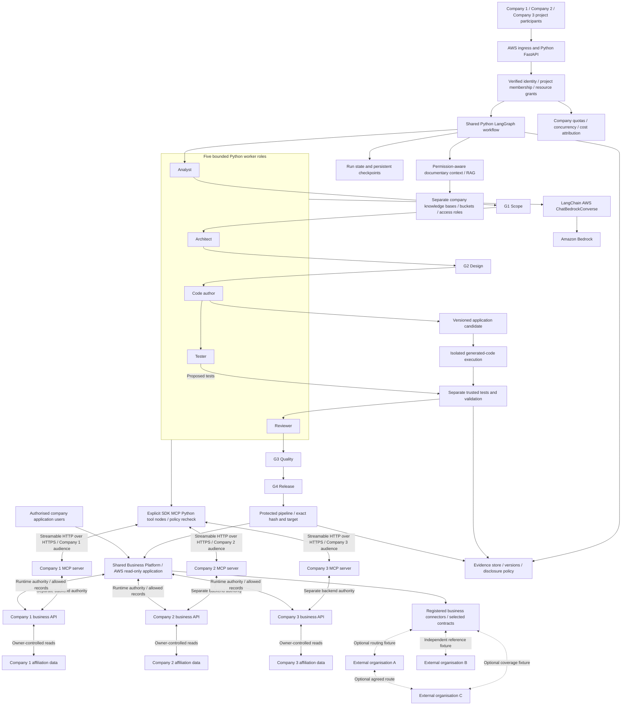
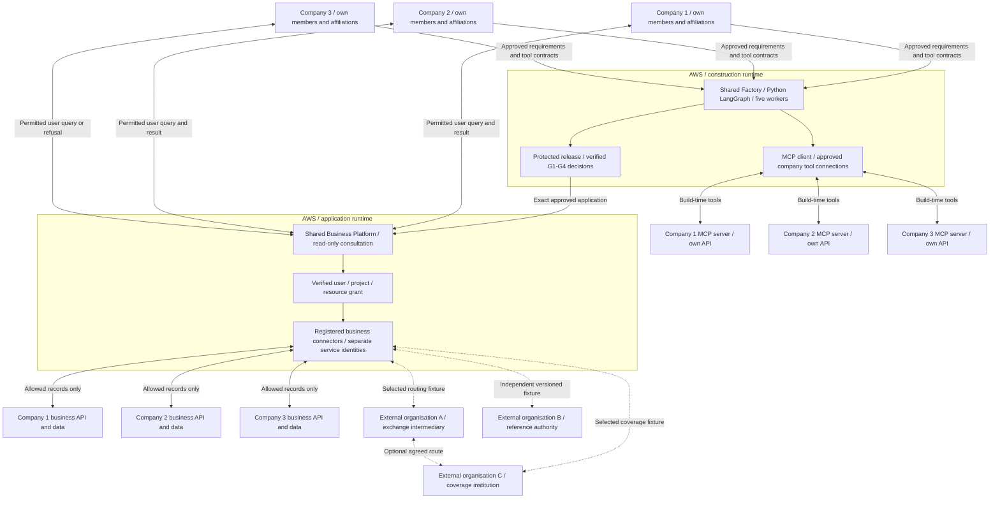
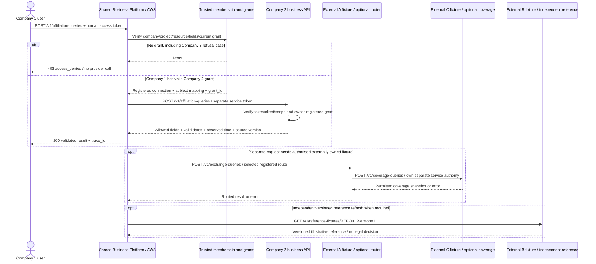

# Shared Factory for Multiple Companies and Governed APIs

By **Yves Schillings, Secloudis** · Architecture review: **1 October 2026**

**Status: proposed target, not implemented.** Several companies will use the same AWS-hosted Factory and workflow definition. Company-specific data, identities, runs, build authority and delivery targets remain isolated. Joint work is enabled only through explicit, revocable grants. AWS is the selected Factory and shared-application POC runtime. Real company/external hosting is unverified; cross-cloud connectors and an Azure Factory edition require separate qualification.

**Gate key:** G means Gate, a human approval checkpoint: **G1 Scope**, **G2 Design**, **G3 Quality**, **G4 Release**. A gate belongs to a project and candidate version; G4 Release authorises only the exact reviewed version for an immutable company/target binding.

## Requirement and proposal boundary

Reusable platform services, standard APIs, identity propagation and permission-aware document access support use by multiple teams. The retained business scenario already involves three companies building a common application and moving from CSV-based exchange to consultation. The later reusable-platform requirement complements that business context. Detailed company registration, grants, MCP connections and release contracts below are this project's proposed implementation; they are not literal interface specifications from those source requirements.

Using AWS as the primary platform with additional cloud or on-premises integrations where required does not mandate simultaneous AWS/Azure deployment. The selected design is one shared AWS Factory with future source/target adapters. It makes no claim that the Factory or its generated applications are already portable between clouds.

The Factory must generate one common, read-only application for three anonymised companies to consult synthetic affiliation records: search, filters, effective dates and owner-authorised access. It implements the already selected CSV-to-consultation scenario, replacing emailed CSV copies with controlled online consultation, and makes no real insurance decisions. RAG supplies the Factory with approved documentary context. Sharing the Factory does not give a company blanket access to another company's data or generated results.

## What the current repository actually does

| Area | Existing baseline | Missing target capability |
|---|---|---|
| Identity | Two explicitly simulated identities with technical scopes `alpha` and `beta`; Cognito verification code derives one tenant/access scope from server-owned group mappings. | Company registration, federated membership lifecycle, service identities and project collaboration policy. |
| Source access | Exact tenant/access-level filters plus source metadata rechecks; a single configured knowledge-base adapter. | Separate company knowledge bases/buckets/roles and governed access to specifically shared resources. |
| Runs | Individual subject ownership plus tenant/access checks; another user's run is not automatically accessible even inside the same scope. | Company/project membership, participant permissions, organization-aware task and artifact contracts. |
| API and execution | `POST /api/runs` already returns 202; a process-local worker pool executes the three-role workflow, with status/source reads and one hash-bound decision. | Durable long-running job acceptance, idempotency keys, cancellation, four gate endpoints and inter-company service contracts. |
| Approval/release | One artifact hash is checked; decision and synthetic artifact publication state use a conditional write, not an application deployment. | Company-specific approver policy and exact candidate/configuration/target binding across G1–G4 and application release. |
| Model adapter | The AWS provider calls boto3 `bedrock-runtime.converse` directly. | LangChain AWS `ChatBedrockConverse` integration and version/behaviour qualification. |
| MCP tools | Official Python SDK with one fixed stdio checklist; no remote company endpoint. | Three company MCP servers, Streamable HTTP/HTTPS clients and owner-authorised business API connections. |
| Deployment | Python/FastAPI with an ECS Express/Fargate managed HTTPS ingress definition and a public Cognito web client using authorization code/PKCE; live cloud services remain unverified. | Shared generated-application runtime, M2M clients/custom API scopes, multi-company resource isolation and optional API-management integration. |

These are source-level and existing local-evidence observations, not a new test run. Inspect [authentication](../authentication.md), [auth.py](../../src/aws_agent_platform_lab/auth.py), [services.py](../../src/aws_agent_platform_lab/services.py), [web.py](../../src/aws_agent_platform_lab/web.py), [retrieval.py](../../src/aws_agent_platform_lab/retrieval.py), [providers.py](../../src/aws_agent_platform_lab/providers.py), [MCP host](../../src/aws_agent_platform_lab/mcp_tool.py), [MCP server](../../src/aws_agent_platform_lab/mcp_server.py) and [dependency definitions](../../pyproject.toml). The two synthetic scopes are not proof of the full multi-company architecture.

## Shared control plane with company boundaries

### Organisational scope

The architecture distinguishes **three participating companies** and **three separately visible external organisations**. The source business context gives examples of external bodies, not an exhaustive requirement for exactly six legal companies. Shared platform operation and the implementation partner are separate delivery responsibilities; they do not replace the external organisations in this view.

The public labels are Company 1, Company 2, Company 3 and External organisation A, B and C. The three companies share the general capability to manage their own members, affiliations and rights. Their different roles in one test illustrate permissions, not permanent or exclusive business functions. External A/B/C have proposed synthetic roles to make exchanges testable; their real protocols, identities, hosting and contracts are not established by this design.

| Box | Business function and synthetic example | Hosting and exchanges |
|---|---|---|
| Company 1 | Own members, affiliations and rights; example use: find a permitted affiliation for `M-001` at a specified date. | Target POC will simulate company endpoint/data on AWS. A real system may use AWS, Azure, another cloud or on-premises; location is unverified. User contacts the shared application; its owned API serves only granted reads. |
| Company 2 | Same general capability for its own members; example use: review the validity period of an affiliation. In the sharing test it owns `C2-SYN-001` and permits a limited read. | Target POC will simulate this environment on AWS; real hosting unverified. Owner business API validates the service client and its registered grant, then returns allowed fields and dates. |
| Company 3 | Same general capability for its own members; example use: filter its own permitted affiliations by status and date. Its denied access to Company 2 is a separate security test. | Target POC will simulate this environment on AWS; real hosting unverified. Its denied application request makes no provider call. It can separately serve authorised requests for its own records. |
| Shared Business Platform | One shared read-only affiliation-consultation application: user access, search/filters, dates, provenance and governed business connectors. | AWS is the chosen POC host. Receives user requests and calls registered company or selected external business APIs; no Factory or MCP hop for a normal read. |
| Shared Factory | Intended to produce application code, tests and review evidence using five workers and four human gates. | AWS is the selected first host. Python/LangGraph orchestrates; LangChain AWS adapts Bedrock; MCP tools access approved company interfaces during construction. |
| External organisation A | Proposed exchange intermediary fixture: validate and route an agreed read message when an external resource requires that route. | Synthetic contract mock to design, optionally hosted on AWS for the POC. Real hosting/protocol unknown. Business connector receives a query and returns a routed result/error; it is not assumed to run MCP. |
| External organisation B | Proposed reference authority fixture: return a versioned illustrative reference `REF-001`, not a legal eligibility decision. | Synthetic versioned fixture/cache to design; real hosting/interface unknown. Independent reference retrieval through an agreed business interface, not a required call on each consultation. |
| External organisation C | Proposed external coverage institution fixture: return authorised affiliation status and effective dates for an externally owned synthetic record. | Synthetic contract mock to design, optionally on AWS; real hosting/interface unknown. Responds through an authorised direct connector or agreed A-to-C route, not both by default. |
| Shared platform team/operator | Operate agreed services, permissions, support and recovery; owners must be assigned. | A human/team responsibility, not a cloud account or additional business company. Operates Factory/application under explicit authority. |
| Implementation partner | Build with internal engineers, document, coach and transfer delivery/operational knowledge. | A delivery responsibility. Connects through approved development and support processes; no automatic data or gate authority. |

### Hosting choice

The proposed proof of concept uses one AWS Factory instance shared by participating companies. Reusing the open-source code and workflow can also support a company's own AWS instance with its own resources once release/licensing requirements are satisfied. Shared code does not require a shared service instance or shared data. Federation between independent Factory instances and porting the Factory runtime to Azure are separate future designs, not capabilities assumed by this proposal.

Retain the existing Python/FastAPI service behind the defined AWS ingress. Extend its current verified identity/source-scope checks with the proposed company/project membership and per-resource policy before shared-company use. A shared controller can reuse worker definitions, model policies and operational tooling while all work carries an explicit, verified company/project context.

AWS distinguishes a shared SaaS control plane from tenant-facing application functionality, and separately warns that authentication/authorization alone does not establish tenant isolation. The following concrete resource layout is this project's proposed design. [AWS control and application planes](https://docs.aws.amazon.com/whitepapers/latest/saas-architecture-fundamentals/control-plane-vs.-application-plane.html), [AWS tenant isolation](https://docs.aws.amazon.com/whitepapers/latest/saas-architecture-fundamentals/tenant-isolation.html)

| Boundary | Proposed ownership and control |
|---|---|
| Company registration | Server-owned company identifier, approved identity issuers/memberships, administrators, resource connections and lifecycle state. |
| Knowledge and source data | Separate knowledge bases and private source buckets per company, with company-scoped access roles. Metadata filters enforce finer permissions within each company space. A metadata filter alone is not the proposed strong company boundary. |
| Runs and evidence | Company/project-bound state and evidence partitions with enforced read/write authority; a shared state service must not permit cross-company lookup or enumeration. |
| Secrets and service roles | Separate company connector credentials and approved role bindings; trusted services resolve them from the registry, never from model text or a caller-supplied role ARN. |
| Candidate repository/build | Company/project-specific repository references, build identity, temporary work area and artifact destination. Generated-code sandboxes have no application role or production credentials. |
| Artifact delivery and target | Each output has a company/project owner, disclosure policy and immutable delivery connection; each deployment manifest binds the company, target, image and configuration. |
| Joint project | A separately governed collaboration workspace references specific grants from participating companies; it does not merge their private data stores or administrator rights. |

The context service, run-state store, evidence store, sandbox, trusted validator, repository/build pipeline and target application retain their distinct responsibilities. Shared code packages do not imply shared execution authority.

The proposed AWS POC will model three simulated company environments, each with distinct MCP/business API endpoints, identities and policies over synthetic data. These do not represent three verified customer AWS accounts or connections to real company systems. Qualify synthetic contracts first; qualify real connectors separately when authorised.

### Proposed component and authority map



The diagram is a target responsibility map, not a deployed topology. All runtime transitions recheck the relevant policy and grant; the visible arrows do not grant authority. Rejection, correction and recovery follow the [target contracts](contracts.md). API Gateway can be assessed later as an optional front door to this service.

### Two different multi-company boundaries

The Factory controls who may request generation, read its evidence and approve or deploy a candidate. The generated common affiliation-consultation application has its own users, company memberships, record permissions, runtime identity and authorised business API connections. It serves all three companies through one application; separate company data/API boundaries do not imply three generated applications. At runtime it calls the business APIs directly, without routing each read through the Factory or its MCP tool host. Factory membership is not application access. Tests must independently verify both boundaries; a correctly isolated Factory does not prove that its generated application isolates the three anonymised company scopes.

### Company quotas and operational fairness

Attribute active runs, queue slots, model/tool usage, concurrency and observed cost to a company/project. Apply company-specific limits and fair scheduling so one participant cannot consume all worker capacity or block others. Shared provider limits still require global admission control, but one company's exhaustion must not silently use another company's allowance. Test saturation, cancellation and recovery across companies; report unknown costs as unknown. Spend alerts alone are not a hard billing ceiling.

## Functional exchanges and hosting



AWS hosts the proposed Factory and Shared Business Platform. Company/external hosting may be AWS, Azure, another cloud or on-premises; this is an integration option, not a confirmed deployment fact. External A/B/C are separately governed business interfaces and proposed synthetic contract mocks, not presumed MCP hosts or Factory tenants. The shared application contacts only the resource owners and optional external services required by the authorised request. See [business functions and hosting](../slides/34-business-functions-and-hosting.md).

## Proposed REST/JSON contract and identity

All paths, scopes, grants and records below are **synthetic target contracts to implement and test**. They do not describe current routes or a real external API. Proposed transport is HTTPS with REST/JSON. The current repository exposes Factory routes such as `POST /api/runs`; it has no generated affiliation application, company M2M resource servers or these business endpoints.

| Caller and endpoint | Proposed operation | Required authority |
|---|---|---|
| User → Shared Business Platform | `POST /v1/affiliation-queries` | Verify human access token; resolve active company/project membership and current resource grant server-side. |
| Platform → registered Company 2 endpoint | `POST /v1/affiliation-queries` | Separate service token with proposed scope `company-2-api/affiliation.read`; owner-registered grant and allowed service client. |
| Selected connector → External A fixture | `POST /v1/exchange-queries` | Separate approved connection and proposed scope `external-a-api/exchange.read`; routing grant for the selected resource. |
| Selected connector or approved A route → External C fixture | `POST /v1/coverage-queries` | Separate connection/service identity and proposed scope `external-c-api/coverage.read`; owner checks the coverage resource grant. |
| Reference connector → External B fixture | `GET /v1/reference-fixtures/REF-001?version=1` | Proposed scope `external-b-api/reference.read`; registered version/policy and independent cache rules. No eligibility decision. |

The current Cognito definition is a public browser client using authorization code with PKCE. The target must add and qualify separate confidential service clients/custom API scopes if Cognito M2M is selected. Verify signature, trusted `iss`, expiry, `token_use`, allowlisted `client_id` and API-specific scopes. **Cognito client-credentials grants do not support resource binding; do not assume an `aud` claim for this path**: intended-API restriction must use the configured scopes and service-client policy, not an invented audience. Other providers must follow their agreed token contract, including audience checks where present. [AWS Cognito scopes, M2M and resource binding](https://docs.aws.amazon.com/cognito/latest/developerguide/cognito-user-pools-define-resource-servers.html)

The service token identifies the application, not the human. Company 2 looks up an owner-registered `grant_id` that binds the allowed service client, requester company, project, purpose, resource, operation, fields and expiry. It compares effective request context against that trusted record and any agreed signed context contract. Plain company/project/purpose headers or body fields confer no authority. Recheck revocation for every action; where per-user enforcement is required, use an explicitly agreed verified delegation/context mechanism rather than asserting that a service token identifies a user.

Never forward the incoming human JWT or MCP token to the company business API. MCP construction tokens have a separate resource/audience contract; qualify its issuer/delegation mechanism independently. Keep credentials outside model context and routine logs. Connections, endpoints, credentials, subject mappings and grants come from the server registry, not caller URLs or prompts.

## Example 1: Company 1 user's request

`POST /v1/affiliation-queries` over HTTPS, `Authorization: Bearer <human-access-token>`, `Content-Type: application/json`. The server creates or validates the trace ID. The date is a fixed synthetic fixture date, not a delivery schedule.

```json
{
  "project_id": "shared-consultation-poc",
  "owner_company_id": "company-2",
  "subject_reference": "M-001",
  "as_of": "2026-01-15",
  "requested_fields": ["affiliation_status", "valid_from", "valid_to"]
}
```

After authentication, the application derives requester Company 1 from trusted membership, resolves the owner connection and maps `M-001` to owner subject `C2-SYN-001`. It resolves `grant-c2-c1-read-001` from trusted policy. These are fixture identifiers, not real member records.

The outbound Company 2 JSON contains `grant_id`, `requester_company_id`, `project_id`, `owner_subject_id`, `as_of`, `requested_fields` and `trace_id`. The registered grant binds the allowed service client to those values and the read operation. The owner independently rejects an unknown, expired, revoked or mismatched grant, wrong client, disallowed field or resource. It does not trust the app merely because its token is valid.

## Example 2: permitted result

`200 OK` returns only allowed fields, with valid-time boundaries, observation time and source version. The fixture interval is inclusive at `valid_from` and exclusive at `valid_to`; null end dates, date/time zones and boundary semantics must be specified in the versioned schema.

```json
{
  "subject_reference": "M-001",
  "owner_company_id": "company-2",
  "affiliation_status": "active",
  "valid_from": "2026-01-01",
  "valid_to": "2026-07-01",
  "observed_at": "2026-01-15T10:00:00Z",
  "source_version": "company-2-fixture-v1",
  "trace_id": "trace-synthetic-001"
}
```

The application validates the response schema and allowed fields and returns the permitted result to Company 1. It preserves provenance and the approved project disclosure policy. It does not infer real insurance rights or request ungranted data to fill gaps.

## Example 3: Company 3 has no grant

An otherwise valid Company 3 user request for this resource receives `403 Forbidden` from application policy **before any provider call**. A neutral message avoids exposing hidden resource details; audit evidence records that the connector invocation count is zero.

```json
{
  "error": {
    "code": "access_denied",
    "message": "The requested operation is not permitted."
  },
  "trace_id": "trace-synthetic-denied-001"
}
```

## Technical sequence and selective external branches



The normal Company 2 consultation ends with its permitted response. The optional blocks illustrate separate authorised resource paths, not additional mandatory calls after success. A direct registered C connector is an alternative to A→C when the agreed contract permits it. No direct company-to-company database link is created.

## Timeouts, denial and test evidence

Proposed initial configurable budgets are a 5-second overall consultation deadline and a 2-second per-connector deadline, with at most one retry for a transient read failure within the remaining total budget. Qualify these values against representative synthetic load; never retry a policy denial. Sequential optional hops share the deadline rather than resetting it.

| Outcome | Public response and required evidence |
|---|---|
| Invalid/expired user identity | `401`; no provider invocation. |
| No applicable user grant | `403 access_denied`; no provider invocation, including Company 3 test. |
| Wrong downstream client/grant/project/resource/field or revoked grant | Owner API refuses; the app fails closed. Test this independently of the app-side refusal. A valid token alone must not pass. |
| Successful allowed lookup | `200`; exact permitted fields, date boundaries, observed time and source version; unrelated fields are absent. |
| Provider connection failure or invalid response | `502 provider_unavailable` or `502 invalid_provider_response`; never claim no affiliation, no rights or record not found. |
| Deadline exhausted | `504 provider_timeout`; bounded calls and traceable outcome. No fabricated fallback. |
| Authorised lookup confirms no matching fixture | Explicit schema-defined `not_found` result, only after successful owner lookup; distinguish it from denied or unavailable. |

Version the OpenAPI request/response/error schemas and run contract tests against each synthetic owner/external mock. Cover grants renewed explicitly after revocation, altered subject mappings, permitted field subsets, time boundaries, correlation, duplicate requests, malformed responses and deadline exhaustion. The read-only POST creates no affiliation update. Store trace IDs and redacted operational metadata; do not log tokens or sensitive identifiers/body fields. These tests belong to existing F01-02/F01-03, F05-04 and F06-03, without adding features or claiming tests have run.

## Selected Python workflow and company MCP connections

This is a **code-first target decision with a separate deterministic local increment**. The local `factory.py` implements five roles, four simulated gates and SQLite gate checkpoints; it does not implement remote company calls, real human authorisation, correction routing or cloud durability. Keep Python/FastAPI behind the defined AWS ingress for the target deployment. Use LangGraph to express typed state, deterministic routing, bounded corrections and human pauses. LangChain AWS `ChatBedrockConverse` remains the selected model adapter, not the workflow engine. Official references describe these distinct roles: [LangGraph overview](https://docs.langchain.com/oss/python/langgraph/overview), [Bedrock integration](https://docs.langchain.com/oss/python/integrations/chat/bedrock). [Development stages](../development-start.md) record the implementation boundary.

Use the official MCP Python SDK inside explicit tool nodes. The Factory acts as an MCP client and selects a server-owned connection ID for Company 1, Company 2 or Company 3. In the target, each company boundary has its own MCP server, which exposes approved tools over Streamable HTTP secured with HTTPS and calls that company's business API. Schemas, tool allowlists, timeouts, budgets, response validation and resource grants remain enforced outside the model. This choice extends the existing stdio MCP checklist rather than replacing its history with a claim that MCP is absent. [MCP Python SDK](https://github.com/modelcontextprotocol/python-sdk), [MCP transports](https://modelcontextprotocol.io/specification/2025-11-25/basic/transports)

The MCP access token is audience-bound to the intended MCP server. The server uses separate, authorised backend credentials or a specifically designed delegation flow for its business API; it does not pass the incoming MCP bearer token through to that backend. For MCP, verify the issuer, intended MCP-server audience, expiry, scopes and current resource grant. For its backend business API, enforce the agreed token contract separately; the Cognito M2M proposal uses API-specific scopes and an allowlisted client_id plus the owner-registered grant, without assuming resource-bound aud. Tokens and credentials are never model context. [MCP authorization](https://modelcontextprotocol.io/specification/2025-11-25/basic/authorization)

No direct Company 1 / Company 2 / Company 3 data links are implied. A shared project may use only explicitly granted resources, purposes and recipients. The owner API decides which records may leave its boundary; a combined result inherits the approved project disclosure policy. Each of the three company connectors must independently enforce refusal, including where another connector was authorised.

The delivered application is a separate runtime. After G4 Release, its registered runtime identity calls only the selected, authorised company business API for a consultation. MCP is the Factory's agent-tool integration path; it is not a required hop for every application read. The common application implements its own user and record authorisation, search/filter semantics, effective dates and provenance.

### Migration and qualification plan

1. Preserve the observed three-role Python workflow and its regression evidence. Define explicit typed state and the five target role contracts, company/project context, hashes, policy versions and error states.
2. Introduce a LangGraph implementation behind the existing service boundary; reproduce existing allowed/denied outcomes before adding Code author, Tester and four gates. Adopt the LangChain AWS adapter through the existing model contract, with pinned versions and contract verification.
3. Qualify persistent checkpoints. `DynamoDBSaver` from the official LangChain AWS checkpoint package is a candidate, not a verified deployment or isolation guarantee. Confirm version compatibility, concurrent writes, company/thread ownership, encrypted storage, retention, crash/restart and pending-approval recovery. [LangGraph persistence](https://docs.langchain.com/oss/python/langgraph/persistence), [AWS checkpoint package, section 4](https://github.com/langchain-ai/langchain-aws/blob/main/libs/langgraph-checkpoint-aws/README.md)
4. Implement G1 Scope, G2 Design, G3 Quality and G4 Release as controlled pauses with authenticated, policy-checked decisions. A graph interrupt is not approval authority. Resume only the authorised run/version; reject stale hashes or revoked grants. LangGraph resumes an interrupted node from its beginning, so actions before the pause must be idempotent or moved into separately controlled steps. [LangGraph interrupts](https://docs.langchain.com/oss/python/langgraph/interrupts)
5. Add and qualify the three remote MCP connections using synthetic records and contracts. Keep the local stdio checklist available for regression checks. Verify wrong audience, wrong company, substituted endpoint, revoked grant, timeout, duplicate response and server restart, as well as permitted consultation.
6. Add isolated code execution, protected independent tests and the exact-version release path for the common application. Durably accepted job dispatch must be implemented before promising restart-safe 202 acceptance; an outbox plus SQS is a candidate design, not part of the current process-local execution proof.

The detailed plan maps to existing EP-05 orchestration/state/context, EP-06 execution, EP-07 release and EP-09 company features. It does not create new feature IDs or claim the target has passed qualification. See [Python workflow](../slides/30-langgraph-workflow-in-python.md) and [shared application/API boundary](../slides/31-shared-application-and-company-apis.md).

## Identity resolution and authorization

Verify token signature, trusted issuer, expiry, token type, allowed client and required scopes before using claims. Validate audience where the selected token contract provides one; Cognito client-credentials M2M does not supply resource binding/aud, as explained in the business contract below. Resolve the caller's active company memberships from a server-controlled policy. For multiple issuers, use an issuer-plus-subject identity key rather than assuming a subject string is globally unique. A company/project identifier in a URL, body or header is a requested resource selection, not evidence of membership.

Never trust an `X-Organization-ID` header, client metadata, prompt or model result to establish company authority. At every API operation and asynchronous step, enforce verified identity, active membership, project role, action permission, resource owner and current sharing grant. Preserve the effective policy version with evidence. AWS describes tenant context as part of SaaS identity, but the membership and project-policy implementation remains application work. [AWS SaaS identity](https://docs.aws.amazon.com/whitepapers/latest/saas-architecture-fundamentals/saas-identity.html)

Use human OIDC sign-in for reviewers and approvers. Give machine-to-machine callers separate registered clients and narrowly scoped OAuth access tokens; a service identity must not be recorded as a human gate approver. Cognito supports confidential clients and custom API scopes for machine-to-machine access. Secrets, if used by a selected connector, remain in company-scoped secret storage and are never passed to a model. [Cognito resource servers and M2M authorization](https://docs.aws.amazon.com/cognito/latest/developerguide/cognito-user-pools-define-resource-servers.html)

## Factory APIs and business connectors are different interfaces

The Factory API controls construction jobs. A business connector reads or writes an explicitly approved external service under that service's contract. A caller permitted to create a Factory run does not thereby obtain the credentials or permissions of a connector.

**The routes below are proposed contracts, not existing endpoints.** Scope all lookups by the authorized project/company, including retries, status reads, artifacts and decisions.

Maintain a versioned OpenAPI specification with request, response and error schemas and automated contract tests. The contract defines compatibility and deprecation rules; a generated client SDK can be added from that same specification. This task proposes the contract and does not implement a server or SDK.

| Proposed route | Contract | Required authorization |
|---|---|---|
| `POST /v1/projects/{project_id}/runs` | Validate and durably accept the request; return `202 Accepted`, server-generated run ID and `Location` for status. Require an idempotency key scoped to company, caller, project and operation. | Active membership plus project run-create permission and allowed source/target bindings. |
| `GET /v1/projects/{project_id}/runs/{run_id}` | Return state, progress, current gate and safe evidence links; disclose no hidden resource names or content. | Project/run read permission plus current resource grants. |
| `POST /v1/projects/{project_id}/runs/{run_id}/gates/{gate}/decisions` | Submit approve/reject, candidate version, exact artifact/manifest hash and expected ETag/state version; reject stale or conflicting decisions. | Verified human identity matching the gate's approver policy and company/project scope. |
| `POST /v1/projects/{project_id}/runs/{run_id}/cancel` | Accept cancellation only where valid, expose `cancellation_requested` until workers stop, and record any completed external effects. | Explicit run-cancel permission; cancellation does not imply rollback of an already completed external action. |
| `GET /v1/projects/{project_id}/runs/{run_id}/artifacts/{artifact_id}` | Deliver only authorized artifacts or registered delivery receipts for the exact version. | Project and artifact disclosure policy plus valid sharing grants. |

For a repeated idempotency key with the same canonical request, return the original run reference; a different payload with the same key is a conflict. Persist accepted work before returning 202, use durable dispatch/recovery, and test duplicate delivery. A 202 response or a process-local thread pool is not proof of durable execution. Do not promise exactly-once external writes: use connector idempotency, expected versions, reconciliation and compensation contracts.

Business connectors are registered separately with owning company, permitted endpoint, OAuth issuer, token/client type, audience where supported, API-specific scopes or approved AWS role, allowed actions, resource scope, network policy and delivery destination. Callers and workers select an approved connection ID; the service resolves its binding and rejects substituted hosts, accounts or role identifiers. Do not forward one company's token to another service unless a specifically implemented, authorized delegation flow permits it.

Optional completion callbacks use pre-registered destinations and authenticated, signed messages with delivery identifiers. Deduplicate received events, bound retries and retain delivery receipts. A job request cannot nominate an arbitrary callback URL; callbacks never replace an authorized status or artifact read.

For AWS cross-account targets, a company may grant a scoped IAM role assumed with temporary credentials. Where the Factory acts as a third party, an ExternalId in the trust policy mitigates confused-deputy risk; it is not a secret. The registered company/role/ExternalId binding and least-privilege permissions must be tested, including a failed assumption without the correct ExternalId. [AWS third-party account access](https://docs.aws.amazon.com/IAM/latest/UserGuide/id_roles_common-scenarios_third-party.html)

## Ingress choice

API Gateway is an optional future front door, not a prerequisite added to the initial AWS deployment. Retain the defined ECS ingress while implementing service-side project/resource authorization. If API Gateway is selected later, qualify its integration, network path, costs and anti-bypass controls; do not depict that topology as already deployed.

An HTTP API JWT authorizer can check issuer, signature, audience and time claims; when route scopes are configured, at least one configured scope must match. That check does not replace the service's full action, project and resource policy. AWS also documents an HTTP API private integration with an ECS service through a VPC link, but compatibility with this project's selected ingress must be designed and tested separately. [API Gateway JWT authorizers](https://docs.aws.amazon.com/apigateway/latest/developerguide/http-api-jwt-authorizer.html), [API Gateway private ECS integration](https://docs.aws.amazon.com/apigateway/latest/developerguide/http-api-private-integration.html)

## Joint projects require governed data-sharing grants

A company may grant a named participant access to a specified resource for a defined purpose and expiry. A grant records the resource owner, recipient company or principal, project, resource/version scope, permitted operations, purpose, expiry, issuer, policy version and revocation state. Derived outputs and artifact delivery need an explicit disclosure rule; access to an input does not automatically authorize redistribution of every resulting artifact.

Check membership and grant validity at intake, retrieval, each task/tool transition, evidence read, gate decision and final delivery. On expiry or revocation, prevent subsequent access and queued use, invalidate relevant caches and pending approvals, and mark affected runs for re-evaluation. Preserve only the audit material allowed by its separate retention policy. Revocation cannot recall bytes already disclosed to a recipient; delivery audit and downstream handling obligations therefore remain necessary.

A proposed positive test has Company 2 grant Company 1 read access to one synthetic affiliation resource inside their joint project until a defined expiry. Company 1 can use that resource for the stated purpose and receive only the allowed result. Company 1 cannot access Company 2's other records, private runs, credentials or builds. Company 3 is refused without a separate grant. This is a designed synthetic acceptance scenario, not a confirmed historical business flow. A result mixing Company 1 and Company 2 inputs inherits an explicitly approved disclosure policy for that project; it does not become generally shareable. Renew or recreate expired/revoked grants explicitly. A prompt asserting collaboration changes none of these permissions.

## Gate and release policy across companies

| Gate | Required decision object and authority |
|---|---|
| **G1 Scope** | Business requirement, project participants, allowed sources and sharing grants; relevant source owners authorize disclosure. |
| **G2 Design** | Component/interfaces, company boundaries, connector authority and target design; designated architecture/security approvers accept the exact design. |
| **G3 Quality** | Candidate manifest and independent test/security evidence; the configured quality approver accepts the tested version, not a worker's unverified report. |
| **G4 Release** | Exact commit/image, configuration, evidence and immutable company/project/target connection; that target's authorized release approver decides. |

An approver policy defines eligible human roles, required company representation, separation of duties and any quorum. It is explicit per project/gate; participation in a joint project is not universal approval authority. Store verified actor, represented company, policy version, decision, reason, candidate hash and state version in the evidence.

The common application has one approved deployment manifest and receipt for its shared target, with the required company representation in its approver policy. A later choice to deliver separate company instances would require distinct target/configuration bindings even if candidate code has the same digest. Changing code, design, source grants, tests or material target configuration invalidates the affected gate decisions. A wrong-company approver, stale ETag or different manifest must block release.

## AWS first and future multi-cloud integration

The initial target control plane and application runtime will run on AWS; their deployment remains unverified. A later adapter may read an authorized Azure/on-premises source or deliver an approved artifact to an Azure/on-premises target while the Factory stays on AWS. That is cross-cloud integration, not evidence that the entire Factory can be redeployed unchanged on another cloud.

Each future adapter needs a registered company connection, provider-specific identity and permissions, network/data-location review, source/version mapping, API contract, idempotency/recovery policy and equivalent positive/negative tests. Porting the Factory runtime itself would be a separate engineering decision. No cross-cloud data flow, deployment or portability is claimed by this design document.

## Proposed feature gaps and dependency order

The dedicated epic is **EP-09 — Shared Factory for Multiple Companies**. All six features are planned. P0 establishes safe shared use of the initial AWS demo; P1 adds durable service APIs, governed joint projects and company-bound approvals/releases.

| Feature | Priority | Dependencies | Acceptance boundary |
|---|---|---|---|
| **F09-01 — Register companies and validate caller membership** | P0 | F03-02 | Verified callers resolve to an active company/project membership; forged company selectors and unmapped identities are denied. |
| **F09-02 — Keep company data, runs and results separate** | P0 | F09-01, F03-03, F04-01 | Separate company knowledge/source/role boundaries and scoped state/artifact access deny cross-company reads and writes. |
| **F09-03 — Test shared use and blocked cross-company access** | P0 | F09-02, F03-04 | Multiple companies use the shared workflow independently; positive own-company cases pass while cross-company access and privilege substitution fail. |
| **F09-04 — Expose stable company APIs for long-running jobs** | P1 | F09-02, F05-03 | Versioned OpenAPI schemas and contract tests define project-scoped 202/Location, durable state, idempotency, status and cancellation; a generated client SDK may follow. |
| **F09-05 — Grant and revoke access to joint projects** | P1 | F09-04, F05-04 | A specifically granted collaborative use succeeds; unrelated resources remain denied and expiry/revocation blocks subsequent use. |
| **F09-06 — Bind each approval and release to its company** | P1 | F09-05, F05-02, F07-02 | Human gate policy and exact company/project/target manifest bind every approval and release; stale or wrong-company decisions fail. |

F04-02 also depends on F09-03 so the initial risk evidence covers shared use. F08-02 also depends on F09-06 before wider enterprise isolation can be accepted. See the [epic and feature backlog](../backlog/epics-features.md).

## Required tests and evidence

| Test | Expected observation |
|---|---|
| Independent shared use | Companies A and B execute the same workflow definition with their own allowed data and receive only their own results. |
| Forged organization or project selector | A valid A token with B's header/path/body identifiers is denied without disclosing B's resources. |
| Wrong issuer/audience/scope or inactive membership | Intake, reads, tools and decisions reject the request; token validity alone does not grant membership. |
| Resource/connection substitution | A caller cannot select another company's knowledge base, bucket, secret, role, build repository or delivery target. |
| Positive joint grant | A specifically approved resource can be consumed by the named recipient for the allowed purpose, and the permitted derived result is delivered. |
| Unshared resource and third company | The collaboration grant does not expose other sources, runs, artifacts or any access for Company C. |
| Grant expiry/revocation during a run | Subsequent task, tool, source/evidence read, approval and delivery are blocked or re-evaluated according to recorded policy. |
| Duplicate and conflicting job requests | Same key/request returns the same run; changed payload conflicts; crash/retry does not create an untracked duplicate action. |
| Approval and release tampering | Wrong-company approver, changed candidate/configuration/target, stale hash or ETag blocks approval/release. |
| Cancellation and connector failure | Acknowledged cancellation has observable completion; partial external effects and recovery actions are recorded without claiming automatic undo. |
| Cross-cloud adapter when added | Authorized flow works and a wrong company/account/source/target is denied using equivalent evidence; no portability claim follows from one connector success. |

Retain expected/observed outcome, exact revision, company/project context, effective policy/grant version, candidate/target hashes and redacted trace references. Existing `alpha`/`beta` mock tests do not complete these new acceptance tests.

Human business/data owners, eligible gate approvers, platform engineers, operators and application users retain distinct authority from the five software agents. The target responsibilities and approval policy are explained in [Actors and Responsibilities](../slides/32-actors-and-responsibilities.md); the [Business and Delivery Ecosystem](../slides/33-business-and-delivery-ecosystem.md) separates organisational blocks and external interface families.

## Related contracts

- [Target Factory contracts](contracts.md): tasks, candidate manifests and four gate decisions.
- [Runtime map](runtime-map.md): implemented components versus target dependencies.
- [Authentication](../authentication.md): existing single-scope identity mapping and limitations.
- [Deployment runbook](../deployment.md): actual AWS platform path and required proof.

**Abbreviations:** API = Application Programming Interface; ARN = Amazon Resource Name; AWS = Amazon Web Services; ECS = Elastic Container Service; ETag = Entity Tag; G = Gate; IAM = Identity and Access Management; JWT = JSON Web Token; KB = Knowledge Base; M2M = Machine to Machine; MCP = Model Context Protocol; RAG = Retrieval-Augmented Generation; SQS = Simple Queue Service; HTTP = Hypertext Transfer Protocol; HTTPS = HTTP secured by Transport Layer Security; OAuth = Open Authorization; OIDC = OpenID Connect; SDK = Software Development Kit; STS = Security Token Service; VPC = Virtual Private Cloud.
