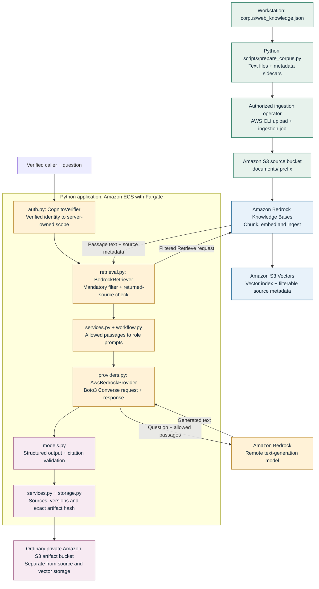

# Retrieval-Augmented Generation: code, data and verification

- **Purpose**
  - Retrieval-Augmented Generation (RAG) supplies a model with relevant, authorized source passages before it writes an answer.
  - This repository's baseline applies that pattern to a synthetic document workflow: retrieve sources, run Analyst, Designer and Reviewer, then stop for an exact-artifact human decision.
  - The separate five-role LangGraph Factory currently produces deterministic proposals. Its future model/context connections must not be confused with the baseline RAG implementation.
- **Current implementation boundary**
  - Local mode uses a checked-in synthetic corpus, simulated identities, lexical search and deterministic model responses.
  - The AWS (Amazon Web Services) adapter code uses Amazon Bedrock Knowledge Bases and an Amazon S3 Vectors index. OpenSearch is not implemented in this repository.
  - Terraform defines cloud resources, chunking, embedding configuration and permissions. Successful cloud ingestion, vector retrieval and model inference still require live evidence.
  - The fixtures use `alpha` and `beta` as technical scope identifiers. They are synthetic workspace labels, not real organizations.

## Pipeline and hosting



- **Colour legend**
  - 🟩 Green: source preparation and controlled ingestion.
  - 🟦 Blue: managed chunking, embeddings and vector retrieval.
  - 🟨 Amber: custom Python request processing and model calls.
  - 🟪 Purple: output validation, evidence and approval binding.
- **Hosting responsibilities**
  - Amazon ECS (Elastic Container Service) maintains the requested application tasks; Fargate provides their processor, memory and isolated runtime on Amazon-managed servers.
  - The custom Python modules above run inside the same application container. Amazon Bedrock models, Knowledge Bases and S3 storage are remote managed services.
  - Boto3 is the official Python library for calling Amazon Web Services. Here it calls `bedrock-agent-runtime.retrieve` and `bedrock-runtime.converse` through separate adapters.
  - Amazon S3 (Simple Storage Service) source objects, the S3 Vectors index and ordinary S3 run artifacts have different responsibilities. An artifact bucket is not a vector index.

## Source files and module contracts

| File | Input | Processing | Output |
|---|---|---|---|
| [`corpus/web_knowledge.json`](../corpus/web_knowledge.json) | Six synthetic document fixtures | Declares scope and provenance | Source text and metadata |
| [`scripts/prepare_corpus.py`](../scripts/prepare_corpus.py) | Checked-in fixtures and a fresh output directory | Exports text and Bedrock metadata sidecars | `.txt` + `.txt.metadata.json` pairs |
| [`infra/main.tf`](../infra/main.tf) | Reviewed account/model/environment variables | Defines source bucket, embedding/index resources and ingestion role | Proposed AWS resource configuration |
| [`auth.py`](../src/aws_agent_platform_lab/auth.py) | Cognito access token | Verifies signature, issuer, expiry, client and scopes; resolves configured group policy | `Principal` with tenant and access level |
| [`retrieval.py`](../src/aws_agent_platform_lab/retrieval.py) | Question and resolved `Principal` | Local lexical ranking or filtered Knowledge Bases retrieval; validates every returned source | Allowed passages with source ID and version |
| [`services.py`](../src/aws_agent_platform_lab/services.py) | Authorized request | Retrieval, fixed tool call, bounded model workflow and safe evidence persistence | Run state and reviewable artifact |
| [`workflow.py`](../src/aws_agent_platform_lab/workflow.py) | Synthetic request and retrieved passages | Creates role prompts; bounds correction rounds | Validated Analyst/Designer/Reviewer outputs |
| [`providers.py`](../src/aws_agent_platform_lab/providers.py) | Role and structured prompt | Mock response or explicit Bedrock Converse call | Untrusted generated text and available usage |
| [`models.py`](../src/aws_agent_platform_lab/models.py) | Generated text and allowed citation IDs | Strict JSON (JavaScript Object Notation), role schema and citation checks | Structured output or validation failure |
| [`storage.py`](../src/aws_agent_platform_lab/storage.py) | Run state and expected storage version | Conditional writes prevent stale decisions from replacing current state | Persisted evidence and version validator |

## Metadata, chunking and embeddings

- **Required provenance and permission fields**
  - `document_id`: stable original-document identifier.
  - `version`: explicit source version, retained with returned passages and the run artifact.
  - `title`: readable source title.
  - `tenant` and `access_level`: exact values checked against server-derived identity scope.
  - `synthetic: true`: restricts this demonstration to declared synthetic fixtures; it is not personal-data detection or a substitute for authentication.
- **One metadata sidecar**
  - The example below accompanies a synthetic text file; it contains no credentials.

```json
{
  "metadataAttributes": {
    "document_id": "ALPHA-POLICY",
    "version": "1",
    "title": "Synthetic document policy",
    "tenant": "alpha",
    "access_level": "internal",
    "synthetic": true
  }
}
```

- **Configuration encoded in Terraform**
  - The Knowledge Bases data source reads only the source bucket's `documents/` prefix.
  - Fixed-size chunking uses at most 300 tokens with 10% overlap. Python does not independently implement that cloud chunking step.
  - The configured embedding model defaults to `amazon.titan-embed-text-v2:0`, with 1,024 dimensions, floating-point vectors and cosine distance. These are configuration defaults, not verified account availability.
  - The embedding model and vector index dimensions must match. Review model availability and permissions in the selected region before deployment.
  - The embedding model represents source passages for retrieval. The text-generation model in `BEDROCK_MODEL_ID` writes answers; it performs a different job.
  - The Knowledge Bases ingestion role reads approved source objects, invokes the embedding model and writes the index. The application task role retrieves passages and invokes the permitted generation model.

## Reproduce the local checks

- **Use the repository environment**
  - Install the pinned dependencies and package as described in the [local demonstration guide](local-demo.md).
  - Run these commands from the repository root. They exercise local fixtures and injected fake AWS clients; they make no paid inference calls.

```powershell
.\.venv\Scripts\python.exe -m unittest discover -s tests -p test_retrieval_contract.py -v
.\.venv\Scripts\python.exe -m unittest discover -s tests -p test_services.py -v
.\.venv\Scripts\python.exe -m unittest discover -s tests -p test_workflow.py -v
.\.venv\Scripts\python.exe scripts/prepare_corpus.py --output artifacts/corpus-export-rag-review
```

- **Expected local result**
  - Tests exercise allowed and denied sources, empty results, missing provenance, inconsistent source versions, citation identity and model-call prevention after retrieval failure.
  - The export contains six text files and six metadata sidecars. Choose another fresh output directory for a repeat export; earlier evidence is preserved.
  - The browser's local mode shows simulated identity and inference explicitly. It does not demonstrate vector relevance or a live Cognito login.

## Run cloud ingestion after the deployment prerequisites are satisfied

- **Required configured resources and settings**
  - Obtain a temporary authorized operator session and verify its intended account and region using the [AWS setup guide](aws-account-setup.md).
  - Follow the reviewed [deployment procedure](deployment.md). Publishing source to GitHub does not execute Terraform or deploy AWS resources.
  - Use the actual Terraform outputs `corpus_bucket`, `knowledge_base_id` and `data_source_id`.
  - Configure runtime `AWS_REGION`, `BEDROCK_KNOWLEDGE_BASE_ID`, `BEDROCK_MODEL_ID`, `ARTIFACT_BUCKET` and the documented Cognito settings. Credentials belong in workload roles or the operator's authorized session, never source files.
- **Upload and start ingestion**
  - Replace each placeholder below with its verified deployment output. The commands are documentation for the authorized operator; they have not been executed by this guide.
  - Review the export before upload. Do not add `--delete` to routine synchronization.

```text
aws s3 sync artifacts/corpus-export-rag-review s3://<corpus_bucket>/documents/ --region <verified-region>
aws bedrock-agent start-ingestion-job --knowledge-base-id <knowledge_base_id> --data-source-id <data_source_id> --region <verified-region>
aws bedrock-agent get-ingestion-job --knowledge-base-id <knowledge_base_id> --data-source-id <data_source_id> --ingestion-job-id <returned-job-id> --region <verified-region>
```

- **Required ingestion evidence**
  - Save the job identifier, completion status, counts and any failures without credentials or private documents.
  - Confirm that text and metadata sidecars were ingested together and that the configured embedding dimensions match the index.
  - A started ingestion job is not evidence of a completed or correct index.

## Permission checks, model context and citations

- **Before retrieval**
  - `CognitoVerifier` resolves one source scope from verified token groups and configured policy.
  - `mandatory_filter` combines exact tenant, access-level and synthetic-data conditions. A browser field, model instruction or query text cannot replace that filter.
- **After retrieval**
  - `BedrockRetriever.search` checks the metadata of every returned passage again. A result outside the caller's scope fails the request even if the search service returned it.
  - Required document IDs, nonempty versions and bounded text must be present.
  - Mixed versions of the same source within one result fail closed. Duplicate copies of the same passage are removed.
  - A chunk citation combines the source identifier with a hash of the passage text. The original document identifier and version remain in the source evidence.
- **Before and after model generation**
  - The service passes only validated sources into the bounded role workflow. A retrieval failure stops execution before constructing the model provider.
  - The prompt includes the synthetic request, passage text and permitted citation identifiers. The stored source evidence also preserves original IDs and versions.
  - `AwsBedrockProvider` calls the configured remote model; `models.py` rejects citations that were not in the retrieved context.
  - A valid citation identifier does not prove that a claim follows from the cited text. Human review and separate answer-quality evaluation remain necessary.
  - The final artifact hash binds the proposal and retained evidence to the reviewed decision. An artifact modified after review cannot reuse that approval.

## Acceptance cases and current limits

| Case | Expected behavior | Evidence |
|---|---|---|
| Allowed source | Return passage text, stable source identity and version for the caller's scope | Offline adapter and service tests; repeat against the deployed index |
| Denied or stale permissions | Reject a mismatched returned scope before model use; recheck retained source scope on reads | `test_services.py` and `test_retrieval_contract.py` |
| Empty result | Fail clearly and do not call a model without permitted context | Dedicated retrieval/service test |
| Missing provenance | Reject missing or blank source versions and invalid identifiers | Dedicated retrieval contract tests |
| Mixed source versions | Reject two versions of the same original document in a single result | Dedicated retrieval contract test |
| Single old source version | Preserve the reported version; freshness against the authoritative source is not currently proven | Requires an ingestion/freshness check and live version policy |
| Unknown citation | Reject an identifier outside the retrieved passage set | `test_workflow.py` |
| Changed reviewed artifact | Reject the old hash instead of accepting the modified proposal | Service and workflow approval tests |

- **Update and deletion limits**
  - Update text and metadata together, run ingestion, and verify the returned source version against the authoritative source before accepting the refresh.
  - The current Terraform data-source deletion policy is `RETAIN`. Removing infrastructure is not a guarantee that indexed content is deleted.
  - Automated source freshness, revocation synchronization and a tested deletion lifecycle remain required work before real enterprise use.
  - A version field proves which version was returned, not that it is the newest. The application has no authoritative live version registry yet.
- **Quality and deployment limits**
  - Offline tests demonstrate application contracts, not retrieval quality in AWS. Evaluate paraphrases, expected source relevance, citations and response latency on a fixed question set after live ingestion.
  - No successful cloud ingestion, vector retrieval, Bedrock inference or AWS deployment is claimed by this document.
  - Keep code publication, live cloud deployment and WordPress publication as separate delivery steps with separate evidence.

## Related engineering documentation

- [Authentication boundary](authentication.md)
- [Deployment and ingestion procedure](deployment.md)
- [Implementation backlog](implementation-backlog.md)
- [Factory development and evidence](development-start.md)
- [AWS Knowledge Bases S3 data-source documentation](https://docs.aws.amazon.com/bedrock/latest/userguide/s3-data-source-connector.html)
- [AWS Knowledge Bases Retrieve API](https://docs.aws.amazon.com/bedrock/latest/APIReference/API_agent-runtime_Retrieve.html)
- [AWS Bedrock Converse API](https://docs.aws.amazon.com/bedrock/latest/APIReference/API_runtime_Converse.html)
